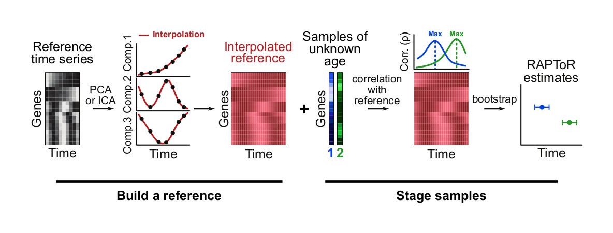

# `RAPToR` R package

`RAPToR` (**R**eal **A**ge **P**rediction from **T**ranscriptome staging **o**n **R**eference) is a tool to accurately predict the developmental age of individual samples from their gene expression profiles. 

We stage samples on high-resolution references that we build from existing developmental profiling time-series.
Inferred age can then be used in multiple ways to 
precisely estimate perturbations effects on developmental timing, 
increase power in differential expression analyses, 
estimate differential expression due to uncontrolled development and 
most importantly, to recover perturbation specific effects on gene expression even in the extreme scenario when the perturbation is completely confounded by development. 

Please cite our paper if you use RAPToR in your research:

 - Bulteau, R., Francesconi, M. Real age prediction from the transcriptome with RAPToR. *Nat Methods* (2022). (https://doi.org/10.1038/s41592-022-01540-0)


## Installation

To install the latest version of RAPToR, run the following in your R console :

```r
if (!requireNamespace("remotes", quietly = TRUE))
    install.packages("remotes")
remotes::install_github("LBMC/RAPToR", build_vignettes = T)
```

When dependencies are met, installation should take under 20 seconds.

### Dependencies
Users can choose to install the RAPToR package dependencies manually from an R console:

```r
# CRAN packages
install.packages(c("ica", "mgcv", "parallel", "data.table", "pryr", "beeswarm", "Rdpack", "R.rsp"))

# Bioconductor packages
if (!requireNamespace("BiocManager", quietly = TRUE))
    install.packages("BiocManager")
BiocManager::install("limma")
```

We also recommend to install the following packages used in RAPToR vignettes to download demo data:
```r
if (!requireNamespace("BiocManager", quietly = TRUE))
    install.packages("BiocManager")
BiocManager::install(c("GEOquery", "biomaRt"))
```

### System requirements
We have verified RAPToR works with R v3.6.3, v4.1.1, and v4.1.2
on Unix (Ubuntu 18.04/20.04/22.04 LTS), Windows 10, and macOS (10.14) systems.

Standard datasets can easily run with 4Gb of RAM and 2 CPU cores. 
For reference, the [GSE80157](https://www.ncbi.nlm.nih.gov/geo/query/acc.cgi?acc=GSE80157) (`dsaeschimann2017`) dataset used for demo in the main vignette (43 samples by ~19500 genes) 
can be both downloaded and staged with RAPToR in under 30 seconds, using less than 2Gb of RAM.


## Getting started

You can access the package's main vignette from your R console with

```r
library(RAPToR)
vignette("RAPToR")
```

### How does it work ?

RAPToR is a 2-step process: 

 1. A reference gene expression time-series is interpolated to build a near-continuous, **high-temporal-resolution reference** (a number of which are included in associated data-packages, see below).
 1. A **correlation profile** of each of your samples against this reference is dressed, and the timing of the correlation peak is the estimated age.  **Bootstrapping on genes** then gives a confidence interval of the estimates.

<center>

</center>

### What data can be used ?
The `RAPToR` package allows you to estimate the developmental age of individual samples from their *gene expression profiles*.
This means that any method outputting information on gene expression on a large scale is appropriate : RNA-seq (preferably TPM), MicroArray...

**Data must not be gene-centered**, as this destroys the relationship between gene levels within a sample.


## Current available data-packages

We recommend you get our data-packages with pre-built references of common organisms for quick & easy usage.

 - [`wormRef` Nematode references](https://www.github.com/LBMC/wormRef) (*C. elegans* embryo, larval and young-adult development)
 - [`drosoRef` Drosophila references](https://www.github.com/LBMC/drosoRef) (*D. melanogaster* embryo development)
 - [`zebraRef` Zebrafish references](https://www.github.com/LBMC/zebraRef) (*D. rerio* embryo and larval development)
 - [`mouseRef` Mouse references](https://www.github.com/LBMC/mouseRef) (*M. musculus* embryo development)


<br>
<br>
<hr>

## Update info

### v1.2
 - Introduced a reference (`ref`) object and corresponding `make_ref()` and print functions. `ref` objects to
   - make reference-building more direct, from a `geim` object,
   - simplify the age estimation call (now simply `ae(samp, ref)`),
   - store reference metadata (such as the reference time unit) for use in subsequent plotting/printing.
 - Updated `ae` object printing to include reference metadata when available.
 - Optimized ae bootstrap correlation (over 2x faster)
 - Rewrote `ae` plotting function to
  - display bootstrap estimates by default.
  - include reference time units when available.
  - fix `ae` plotting graphics bug (larger first plot with overlayed and missing elements) when displaying multiple plots side by side.
  - add sample label control (truncate, adjust margin space)
  - cover more parameter edge cases
 - Updated `geim` printing to include reference metadata when available.
 - Added functions to compare log-fold-changes between sample groups to a reference and quantify the impact of development on differential expression analysis. 
  - `ref_compare()` gets matching reference time points to the samples and compares logFCs between given sample groups, and between matching reference time points (giving an estimate of development logFCs between groups).
  - `get_logFC()` extracts sample and reference logFCs between specified groups from the output of `ref_compare()`.
 - Renamed `plot_cor.ae()` to `plot_cor()`.
 - Updated documentation:
  - Added a vignette on correcting DE analysis for development `vignette("RAPToR-DEcorrection")`
  - Updated vignette sections related to reference-building with the new objects.
  - Added a reference-building section and examples for aging references
  - Re-formatted vignettes with Bioconductor style
  - Added PDF versions of all vignettes

### v1.1
#### v1.1.6 (used in Bulteau & Francesconi 2022 publication)
 - Revised the main vignette.
 - Updated README info.
 - Included biocViews in `DESCRIPTION` to automatically install bioconductor dependencies (thanks @helenmiller16).
 - Removed deprecated pls-dependent functions.
 - Fixed edge cases for 1-component reference building.

#### v1.1.5b
 - Added software, hardware, and runtime info to README. 
 - Added installation instructions for dependencies. 

#### v1.1.5
 - Added preprint citation to README and documentation.
 - Updated showcase vignettes relevant to the paper analyses

Prior updates can be found in the [NEWS](./NEWS) file.