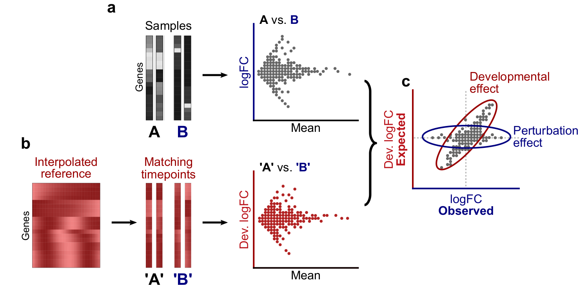

  
```{r chunkopt, include = FALSE}
gen_figs <- T # whether to generate figures or read from RAPToR-DEcorrection_files/figs

knitr::opts_chunk$set(
  collapse = TRUE,
  comment = "#>",
  fig.align = "center",
  out.width = '100%',
  eval = gen_figs,
  cache= T
)
options(width=100)

figpath <- "../inst/cdoc/RAPToR-DEcorrection_figs/"
if(!file.exists(figpath)){
  dir.create(figpath)
}

```

```{r sc4_genfig_setup, include = F}
png_custom <- function(figname, path = "", 
                       fig.width = 7, fig.height = 5, res = 150, ...){
  png(filename = paste0(path, figname, ".png"), 
      width = fig.width, height = fig.height, res = res, units = "in")
}

show_fig <- function(figname = knitr::opts_current$get("label"), expr, path = figpath, ...){
  if(gen_figs){
    png_custom(figname = figname, path = figpath, ...)
    eval(expr = expr)
    dev.off()
  }
  else{
    knitr::include_graphics(paste0(path, figname, ".png"))
  }
}

```

```{r sc4_useful_functions, echo=F}
gg_hex2d <- function(x, y=NULL, rg = range(xy, na.rm = T)*1.02,
                     l.breaks = log1p(c(0, 1, 5, 10, 50, 100, Inf)),
                     l.labels = c('1', '5', '10', '50', '100', '100+'),
                     nbins = 200,
                     xlab = "log2(FC) in x",
                     ylab = "log2(FC) in y",
                     main = "", get.r =T, add.vd = T,
                     DEgsel = NULL,
                     ...){
  # Make a 2d binned hexplot for showing logFC comparison
  require(ggplot2)
  require(viridisLite)
  if(is.null(y))
    xy <- x
  else
    xy <- cbind(x, y)
  xy <- as.data.frame(xy)
  
  colnames(xy) <- c("x", "y")
  
  g <- ggplot(data = xy, mapping = aes(x=x, y=y)) + 
    stat_bin_hex(aes(fill = stat(cut(log1p(after_stat(count)), breaks = l.breaks, 
                                 labels = F, right = T, include.lowest = T))), 
             bins=nbins) +
    scale_fill_gradientn(colors = viridisLite::inferno(length(l.breaks)), 
                         name = 'count', labels = l.labels) + 
    theme_classic() + xlim(rg) + ylim(rg) +
    xlab(xlab) + ylab(ylab) + ggtitle(main) + coord_fixed()
    if(get.r){
    if(any(is.na(xy))){
      message("Warning: removed NA values to compute correlation coefs")
      rmsel <- apply(xy, 1, function(r) any(is.na(r)))
      xy <- xy[!rmsel,]
      if(!is.null(DEgsel))
        DEgsel <- DEgsel[!rmsel]
    }
    
    cc <- cor(xy)[1,2]
    cc2 <- cor(xy, method='spearman')[1,2]
    cctxt <- paste0("r = ", round(cc, 3), '\nrho = ', round(cc2, 3))
    if(add.vd)
      cctxt <- paste0(cctxt, "\n", round(100*(cc^2), 1), "% VarDev")
    if(!is.null(DEgsel)){
      ccDE <- cor(xy[DEgsel,])[1,2]
      cctxt <- paste0(cctxt, "\nr(DE) = ", round(ccDE, 3))
      if(add.vd)
        cctxt <- paste0(cctxt, "\n", round(100*(ccDE^2), 1), "% VarDev(DE)")
    }
    
    g <- g + annotate(geom="text", hjust=1, vjust=0,
                      x = rg[2],
                      y = rg[1],
                      label = cctxt)
  }
  
  return(g)
}


transp <- function(col, a=.5){
  # make a color transparent
  colr <- col2rgb(col)
  return(rgb(colr[1,], colr[2,], colr[3,], a*255, maxColorValue = 255))
}

twoTicks <- function(side = c(1,2), col = NA, col.ticks = 1, las = c(1,2), ...){
  # Generate 2 (edge) ticks on given axis of current plot
  # col = NA & col.ticks = 1 makes the axis line dissapear, but keeps ticks
  for(i in seq_along(side)){
    axt <- axTicks(side[i])
    axis(side[i], at = axt[c(1, length(axt))], col = col, 
         col.ticks = col.ticks, las = las[i], ...)
  }
}

```

# Introduction 

The developmental speed of fast-growing organisms such as *C. elegans* is under the influence of many different factors -- including experimental conditions themselves -- making it difficult (or impossible) to collect age-matched individuals between conditions. 
For example, if a mutant has delayed development but controls and mutants are collected at the same chronological (and therefore different physiological) time, the perturbation of interest will be completely confounded with development.
Because of this, purely developmental gene expression changes can be mislabeled as the effect of a variable of interest.

When sample groups have age differences but still overlap, the developmental effect can simply be accounted for by including age as a covariate in the Differential Expression (DE) analysis. 
If there is no age overlap however, it becomes impossible to know whether an observed effect is due to the perturbation or age since both variables are completely confounded.

Using `RAPToR` reference data, we can bridge the gap between non-overlapping sample groups and rescue otherwise impossible DE analyses.

<br>
<br>


## Correcting the effect of development in DE analysis

To *correct* the effect of development, we must integrate reference data in the DE analysis. 
This complicates the analysis, but makes it possible to recover truly DE genes when there is no age overlap between the compared sample groups thanks to the reference bridging the developmental gap.

Most DE analysis tools require counts as inputs (due to their particular statistical properties), so the interpolated reference data needs to be converted from TPM to artificial counts, assuming an arbitrary fixed library size ($25\times 10^6$ counts).
Then, because gene dispersions needed for statistical testing cannot be estimated from this noiseless artificial reference, we infer them from a model without reference data and inject them into the model with reference data. 

Thus, resulting model coefficients (logFCs) between sample groups are corrected for development by the reference, and their respective statistical tests use dispersion inferred only from samples.
We use [`DESeq2`](https://bioconductor.org/packages/DEseq2) in this vignette.


Note: this approach improves upon what is presented in the RAPToR paper and outputs valid p-values.


# Example 

## Data and strategy

[@miki2017two](https://www.ncbi.nlm.nih.gov/pmc/articles/PMC5695088/) profiled time-series of *C. elegans* wild-type (WT) and *xrn-2* mutants ([GSE97775](https://www.ncbi.nlm.nih.gov/geo/query/acc.cgi?acc=GSE97775)). Code to download this data and generate the `dsmiki2017` object can be found [at the end of this vignette](#code-gen_dsmiki2017)

By selecting specific samples from both time-series, we define a gold-standard of DE genes with samples of matching development.
Then, we can evaluate the effect of increasing developmental shifts between the groups on the DE analysis by sliding the window of WT samples.


```{r sc4_libload, message=FALSE, warning=FALSE, echo=T}
library(RAPToR)
library(wormRef)

library(DESeq2)
library(splines)
library(ROCR)

library(ggplot2)
library(ggpubr)
library(viridis)

# for plotting
col.palette1 <- c('grey20', 'firebrick', 'royalblue', 'forestgreen')
col.palette2 <- viridisLite::viridis(5)
```

```{r sc4_load, include=F}
load("../inst/extdata/dsmiki2017.RData") 

```


## Estimating sample age

We use RAPToR to infer sample age.

```{r sc4_ae_samples, results='hide'}
# load reference 
r_cel <- RAPToR::prepare_refdata("Cel_larv_YA", "wormRef", 600)

# get sample age estimates
ae_miki <- RAPToR::ae(dsmiki2017$g, r_cel)
dsmiki2017$p$ae <- ae_miki$age.estimates[, 1]
```

```{r plot_ae, fig.height=5, fig.width=8}
plot(ae_miki, show.boot_estimates = F, 
     group = dsmiki2017$p$strain_long, color = col.palette1[dsmiki2017$p$strain],
     main = "Miki et al. (2017) samples", l.pos = "topright", lmar = 10, g.line= 1)
```

## Defining gold-standard and sample sets for comparison

We select a set of 3 WT and mutant samples as the gold-standard set, and define WT 3-sample sets shifted by 1, 2, 3, 5, and 7 time points.
```{r sc4_gs_def, eval = gen_figs}
GS_wt <- 8:10 # gold standard WT samples
GS_mut <- 19:21 # GS mutant samples

shifts <- -c(1,2,3,5,7) # number of timepoints to shift
subs <- c(list(gold.standard = c(GS_wt, GS_mut)),
          lapply(shifts, function(s) c(GS_wt + s, GS_mut)))
names(subs)[-1] <- paste0('s', abs(shifts))
```

```{r plot_subs, echo=F, fig.height=6, fig.width=7, results='hide'}
par(mfrow = c(1,1), pty = "s", xpd=T)
plot(ae~age, data = dsmiki2017$p, 
     xlab = "Chronological age (h past L4 stage, 25°C)",
     ylab = "RAPToR age estimates (h post-hatching, 20°C)",
     col = col.palette1[dsmiki2017$p$strain], lwd = 2,
     xaxt = "n", yaxt = "n", bty = "l") ; twoTicks()
invisible(sapply(levels(dsmiki2017$p$strain), function(l){
  points(ae~age, data = dsmiki2017$p[dsmiki2017$p$strain==l,], type = "l", lty = 2,
         col = col.palette1[which(levels(dsmiki2017$p$strain)==l)])
}))
xyoffsets <- cbind(x=c(.7, .9, 1.1, 1.3, 1.5),
                   y= 0 )#c(.6,.5,.75,.75,.75))
invisible(lapply(seq_along(subs), function(i){
  s <- subs[[i]]
  if(names(subs)[i] == 'gold.standard'){
    ym <- dsmiki2017$p$ae[s[4:6]]
    xm <- (ym - 43)/1.7 
    yw <- dsmiki2017$p$ae[s[1:3]]
    xw <- (yw - 43)/1.7 
    
    points(xm-.5, ym, type = 'l', lwd = 3, col = col.palette1[2])
    text(mean(xm-.5), mean(ym), pos = 2, labels = "xrn-2\nsubset", adj = 1, 
         col = col.palette1[2], font = 2, offset = 1)
    segments(range(xm-.5), range(ym), range(dsmiki2017$p$age[s[4:6]]), range(ym), col = col.palette1[2], lty = 3)
    
    points(xw+.5, yw, type = 'l', lwd = 3, col = col.palette1[1])
    text(mean(xw+.75), mean(yw), pos = 4, labels = "WT gold\nstandard", adj = 0, 
         col = col.palette1[1], font = 2, offset = 1)
    segments(range(xw+.5), range(yw), range(dsmiki2017$p$age[s[1:3]]), range(yw), col = col.palette1[1], lty = 3)
  } else {
    y <- dsmiki2017$p$ae[s[1:3]]
    x <- (y - 43)/1.7
    
    points(x+xyoffsets[i-1,1], y-xyoffsets[i-1,2], type = 'l', lwd = 3, col = col.palette2[i-1])
    text(mean(x+xyoffsets[i-1,1]), mean(y-xyoffsets[i-1,2]), 
         pos = 4, labels = paste0("WT ", shifts[i-1]), adj = 0, 
         col = col.palette2[i-1], font = 2, offset = 1)
    segments(range(x+xyoffsets[i-1,1]), range(y-xyoffsets[i-1,2]), 
             range(dsmiki2017$p$age[s[1:3]]), range(y-xyoffsets[i-1,2]), col = col.palette2[i-1], lty = 3)
    
  }
  
}))

legend("bottomright", bty = "n", lty = 2, pch = 1, lwd = 2,
       col = col.palette1[1:2], legend = c("wild-type", "xrn-2(xe31)"), text.col = col.palette1[1:2])
```


## Quantifying expression changes caused by a developmental shift with `ref_compare()``

In two conditions 'A' and 'B' where the sample groups have developmental differences, the expression changes (or log-fold changes, logFCs) observed between the groups will be a combination of perturbation and developmental effects (**a**).

With age-matched interpolated reference expression profiles, we determine what expression changes are expected only from the developmental difference (**b**). 
Any correlation between observed (sample) and expected (reference) logFCs will be due to the developmental effect, with uncorrelated logFCs corresponding to the perturbation effect (**c**).
The bigger the developmental effect, the greater the correlation.

{width="75%"}

The `ref_compare()` function inputs:

 - sample data (expression matrix, expects log(TPM+1) as transcripts per million are more comparable across datasets)
 - the reference object used for age estimation,
 - the `ae` object (or age estimate values for the samples)
 - and a group variable (*e.g.* a factor defining WT and mutant) and age-matched reference profiles. 
 
```{r sc4_refcompare}
s <- subs$s3 # selecting WT-3 sample subset for the example

rcomp <- ref_compare(
    X = dsmiki2017[, s], 
    ref = r_cel,
    ae_values = ae_miki$age.estimates[s, 1],
    group = dsmiki2017$p$strain[s]
)
```

The resulting sample and reference logFCs can be extracted with `get_logFC()`


We run the comparison for all the sample sets defined above, and plot the reference logFCs vs. sample logFCs. 

```{r sc4_crefcomp, results='hold'}
rcs <- lapply(subs, function(s){
    RAPToR::ref_compare(
      X = dsmiki2017$g[, s],  # sample data (expects log(TPM+1))
      ref = r_cel,            # reference object
      ae_values = ae_miki$age.estimates[s,1], # ae values of samples
      fac = dsmiki2017$p$strain[s]            # factor defining compared groups
      )
})
```

```{r sc4_lfc_planes, message=FALSE, warning=FALSE, fig.height=6, fig.width=9}
ggs <- lapply(1:6, function(i){
  logFCs <- RAPToR::get_logFC(rcs[[i]])
  gg_hex2d(logFCs, rg = c(-10, 10), xlab = "Sample logFC", ylab = "Reference logFC",
           main = c('Gold-Standard', paste("WT", shifts))[i], 
           get.r = T, add.vd = T)
})
lfc_planes <- ggarrange(plotlist = ggs, ncol=3, nrow = 2, common.legend = T) 

print(lfc_planes)
```

As expected, age-matched reference logFCs (*i.e* development) account for increasing proportions of expression changes with larger age differences between groups. 
$R^2$ between sample and reference logFCs is a rough estimate of percentage of variance explained by development (VarDev), indicated in the bottom-right corner of each plot. 


#### Code to generate `dsmiki2017` {.tabset}

<a name="code-gen_dsmiki2017"></a>
  
##### Hide
  
##### Show

**Note : set the `data_folder` variable to an existing path on your system where you want to store the objects.**

```{r sc4_load_namespaces, eval = F}
data_folder <- "../inst/extdata/"

library("GEOquery") # May need to be installed with bioconductor

requireNamespace("wormRef", quietly = T)
requireNamespace("utils", quietly = T)
```

```{r sc4_load_dsmiki_c, code = readLines("load_dsmiki2017.R"), echo = TRUE, eval = FALSE}
```

<br>

#### Code for plotting functions {.tabset}

<a name="code-plotting_functions"></a>
  
##### Hide
  
##### Show

```{r sc4_useful_functions, eval = F}
```

