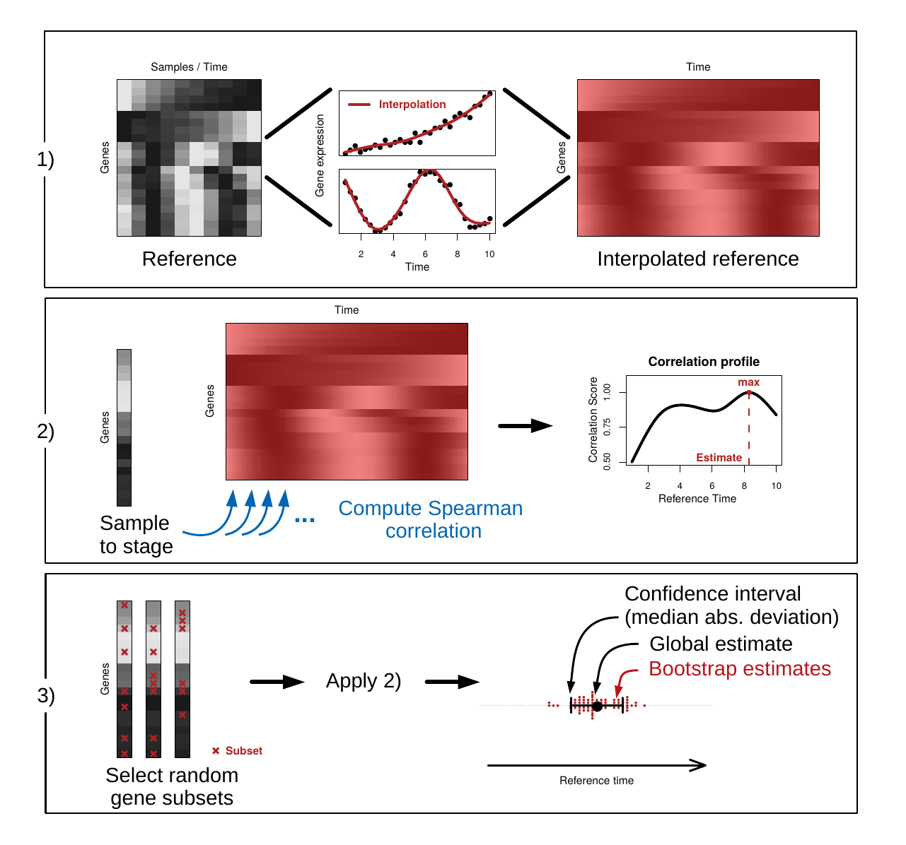

  
```{r, include = FALSE}
knitr::opts_chunk$set(
  collapse = TRUE,
  comment = "#>",
  fig.align = "center",
  out.width = '100%'
)
options(width=100)
gen_figs <- F # whether to generate figures or read from RAPToR-refbuilding_files/figs

figpath <- "../inst/cdoc/RAPToR_figs/"
if(!file.exists(figpath)){
  dir.create(figpath)
}

library(RAPToR)

library(ggplot2)
library(ggpubr)
requireNamespace("limma", quietly = T)
```

```{r genfig_setup, include = F}
png_custom <- function(figname, path = "", 
                       fig.width = 7, fig.height = 5, res = 150, ...){
  png(filename = paste0(path, figname, ".png"), 
      width = fig.width, height = fig.height, res = res, units = "in")
}

show_fig <- function(figname = knitr::opts_current$get("label"), expr, path = figpath, ...){
  if(gen_figs){
    png_custom(figname = figname, path = figpath, ...)
    eval(expr = expr)
    dev.off()
  }
  else{
    knitr::include_graphics(paste0(path, figname, ".png"))
  }
}

```

<br>
<br>

Gene expression profiling has become standard practice and serves as the basis of many analyses in biology. 
However, gene expression is highly variable during development. 
Unknown and unintended developmental variation among samples can
obscure and confound the effect of variables of interest in a study. 
This is especially a problem for fast-developing organisms such as *Caenorhabditis elegans*, where drastic developmental changes in gene expression occur within hours. 
The developmental speed of such organisms is usually heavily influenced by numerous factors and therefore obtaining developmentally synchronized samples is not trivial. 
Genome-wide gene expression is a very rich source of data, which includes information about the developmental stage of an organism. 
However, methods that extract this information are still lacking.

We present `RAPToR`, a new tool to accurately predict individual samples' developmental age from their gene expression profiles. 
We achieved this by building high-temporal-resolution time series across the entire development from multiple available datasets, which we use as a reference to stage samples. 
Inferred age can be included as a covariate in analyses and increase their power to detect differential expression by including time-dependant effects. 
<!-- We also show multiple examples of how development impacts gene expression studies in multiple organisms. -->

<!-- `RAPToR` was developped to mediate the issue of developmental differences between samples by estimating the true age of transcriptomic samples from their gene expression profiles.  -->
<!-- While this is a major problem in the field of *C. elegans*, this issue occurs in various models where many factors can impact development speed (*e.g* *Drosophila*).  -->


# Why use `RAPToR` ?

Imprecise developmental staging is a known problem in transcriptomic analyses.
Unknown and unintended developmental variation among samples can obscure and confound the effect of variables of interest in a study.
For example, when large developmental timecourse datasets are produced, the samples are almost always re-ordered post-profiling.
This is because we are unable to experimentally synchronize samples to a satisfactory degree.

The methods used in the above scenario are usually a combination of a dimension-reduction analysis (*e.g* PCA, Diffusion Map) and a trajectory-finding method.
This can work when your experiment has hundreds of samples and/or happens to be a time series, but this is clearly not the general standard of current gene expression studies. 
The problem we are faced with is not limited to large scale experiments, why should we only address it in such scenarios ? 

`RAPToR` provides a way to precisely determine the real age of *single samples* from their expression profile.


# How does it work ?

The method works in a three-step process. 

 1. From a reference gene expression time series (several of which are included in associated data-packages), a near-continous, **high-temporal-resolution reference** is built.
 1. A **correlation profile** of your samples against this reference is computed from the gene expression information, the peak of which corresponds to the estimated age.
 1. A **bootstrap procedure** of the previous step on random subsets of genes is performed to give a confidence interval of the estimates.

<center>
{width=60%}
</center>

# What type of data can be used ?

The `RAPToR` package allows you to estimate the developmental age of samples from their transcriptome.
This means that any data providing information on gene expression on a large scale is appropriate : normalized RNA-seq counts (preferably TPM), MicroArray/Chips...
Note that the references provided in the data-packages are $log(X+1)$ of expression values, applying this transformation to your data may lead to better performance of the tool.  

<div class="alert alert-danger">
  <strong>Warning :</strong><br/>
**The data must not be gene-centered**, as this destroys the relationship between gene levels within a sample.
</div>


# General structure of the tool

The main package (`RAPToR`) holds all the necessary functions to stage samples and build references.

We've aimed to provide a way to predict the age of samples easily and,
since our method requires a reference to stage samples against, we've built several from available data in the literature.
For R package standards, these are large datasets so the references are stored in separate "data-packages". 
To give an example, `wormRef` holds the *C. elegans* references.

You can see the available references of a data-package with the `list_refs()` function. 
**Note that you must have the data-package installed for this**. 
[`wormRef` can be installed from this link.](https://github.com/LBMC/wormRef)

```{r list_refs}
list_refs("wormRef")
```

The data-packages currently available are listed on the [README of the github repo](https://github.com/LBMC/RAPToR).
You can also build your own reference data-packages following a few rules given in the [vignette on this topic](RAPToR-datapkgs.html).


# Usage example

In this part, we'll be showcasing usage of the tool on two *C. elegans* time series datasets from the literature.
Note that you will need the `wormRef` package installed to use its references ( [see here for installation](https://github.com/LBMC/RAPToR) ).

 1. A time series of larval development in 4 different strains published by @aeschimann2017lin41, hereafter called `dsaeschimann2017`.
 1. A high-resolution time series of late larval development published by @hendriks2014extensive, hereafter called `dshendriks2014`

Both datasets are available on GEO 
(
[GSE80157](https://www.ncbi.nlm.nih.gov/geo/query/acc.cgi?acc=GSE80157), 
[GSE52861](https://www.ncbi.nlm.nih.gov/geo/query/acc.cgi?acc=GSE52861)
).


## Loading the data
```{r load_pkg,  eval = F}
library(RAPToR)
```

As the code to create the `dsaeschimann2017` and `dshendriks2014` objects is quite lengthy and is not the object of this vignette, you can find it [at the end of the document](#load_dsaeschimann2017_dshendriks2014).


```{r load_ds, include=FALSE, eval=gen_figs}
load("../inst/extdata/dsaeschimann2017.RData")
load("../inst/extdata/dshendriks2014.RData")
```


Here is what our data looks like 
```{r head_dsaeschimann2017, eval = gen_figs}
dsaeschimann2017$g[1:5,1:4]
#>                let.7.n2853._18hr let.7.n2853._20hr let.7.n2853._22hr let.7.n2853._24hr
#> WBGene00007063          7.501850         10.988212          10.45480          7.994587
#> WBGene00007064          8.023767          8.655388          14.21012          9.759401
#> WBGene00007065         15.919452         16.875057          15.23932         18.847718
#> WBGene00003525          1.416181         10.938876          13.42202          2.488798
#> WBGene00007067          1.765342          1.775650           2.77224          2.200257

head(dsaeschimann2017$p, n = 5)
#>                        title geo_accession           organism_ch1       strain
#> GSM2113587 let.7.n2853._18hr    GSM2113587 Caenorhabditis elegans let-7(n2853)
#> GSM2113588 let.7.n2853._20hr    GSM2113588 Caenorhabditis elegans let-7(n2853)
#> GSM2113589 let.7.n2853._22hr    GSM2113589 Caenorhabditis elegans let-7(n2853)
#> GSM2113590 let.7.n2853._24hr    GSM2113590 Caenorhabditis elegans let-7(n2853)
#> GSM2113591 let.7.n2853._26hr    GSM2113591 Caenorhabditis elegans let-7(n2853)
#>            time in development:ch1 age
#> GSM2113587                18 hours  18
#> GSM2113588                20 hours  20
#> GSM2113589                22 hours  22
#> GSM2113590                24 hours  24
#> GSM2113591                26 hours  26
```

```{r head_dshendriks2014, eval = gen_figs}
dshendriks2014$g[1:5,1:5]
#>                contDevA_N2_21h contDevA_N2_22h contDevA_N2_23h contDevA_N2_24h contDevA_N2_25h
#> WBGene00007063       2.7298009        2.928176       2.3023107        2.960860        3.275716
#> WBGene00007064       5.2372118        6.161017       7.0817623        5.769718        6.910397
#> WBGene00007065      14.5928869       11.448793       9.7072795       11.616851       11.769170
#> WBGene00003525       0.2554172        1.182322       3.8705742       10.072059       16.148716
#> WBGene00007067       1.3860572        1.025319       0.6974292        1.031272        1.765380

head(dshendriks2014$p, n = 5)
#>                      title geo_accession time in development:ch1 age
#> GSM1277118 contDevA_N2_21h    GSM1277118                22 hours  22
#> GSM1277119 contDevA_N2_22h    GSM1277119                23 hours  23
#> GSM1277120 contDevA_N2_23h    GSM1277120                24 hours  24
#> GSM1277121 contDevA_N2_24h    GSM1277121                25 hours  25
#> GSM1277122 contDevA_N2_25h    GSM1277122                26 hours  26
```

We'll quantile-normalize and log the expression data.
```{r quantile_norm_log, eval = gen_figs}
dsaeschimann2017$g <- limma::normalizeBetweenArrays(dsaeschimann2017$g, method = "quantile")
dsaeschimann2017$g <- log1p(dsaeschimann2017$g) # log1p(x) = log(x + 1)

dshendriks2014$g <- limma::normalizeBetweenArrays(dshendriks2014$g, method = "quantile")
dshendriks2014$g <- log1p(dshendriks2014$g)
```


The only other transformation the data may need is to convert its probe IDs or gene IDs to match the reference series'. 
For example, all the references included in the `wormRef` data-package use WormBase Gene IDs (*e.g.* `WBGene00016153`).

To help with this conversion, gene ID reference tables should be included in the data-packages with common gene IDs (built directly from the `biomaRt`).


## Choosing a reference dataset

`RAPToR` estimates the developmental age of samples based on correlation with reference time series datasets. 
This means you have to select the proper reference to run your samples against.
By looking at reference list like above, or using the `plot_refs()` function, you can determine which reference is appropriate for your samples. 
If we haven't built your favorite organism's references yet, you can take a look at [how to build your own reference](#building-your-own-references) for a quick-start guide or the [reference-building vignette](RAPToR-refbuilding.html) for a more in-depth explanation.

The chart below shows the reference datasets available in the `wormRef` data package, along with landmark developmental stages. 

```{r plot_refs, fig.height=6, fig.width=9}
(plot_refs("wormRef"))
```


## Loading the reference

To bypass the limitations of available time series' reolution and provide precise estimates, `RAPToR` interpolates on the dynamics of gene expression of the reference series.
You can load a pre-built reference dataset with optimal parameters using the `prepare_refdata()` function.

For our example, the `Cel_larval` dataset would be appropriate since our samples are from mid-larval to early young adult in both datasets.
The `n.inter` parameter corresponds to the resolution of the interpolated reference. 
In the interest of lightening the computational load you can choose smaller values, but aim over the 500s for optimal results.


```{r prep_ref, eval=gen_figs}
r_larv <- prepare_refdata("Cel_larval", "wormRef", n.inter = 600)
```

Note that age estimates will be given in the time unit and scale of the chosen reference (here, hours post-hatching at 20$^\circ$C).


## Performing a simple age estimate

All we need to do now is run the `ae()` function.

```{r include=FALSE, eval=gen_figs}
set.seed(1)
```


```{r ae_dsaeschimann2017, eval=gen_figs, results='hold'}
ae_dsaeschimann2017 <- ae(samp = dsaeschimann2017$g,                         # input gene expression matrix
             refdata = r_larv$interpGE,            # reference gene expression matrix
             ref.time_series = r_larv$time.series) # reference time series
#> Bootstrap set size is 6239
#> Performing age estimation...
#> Bootstrapping...
#>  Building gene subsets...
#>  Computing correlations...
#>  Performing age estimation...
#> Computing summary statistics...
#> Warning in ae(samp = dsaeschimann2017$g, refdata = r_larv$interpGE, ref.time_series = r_larv$time.series): Some estimates come near the edges of the reference.
#> If possible, stage those on a different reference for confirmation.
#>                 nb.genes
#> refdata            18718
#> samp               19595
#> intersect.genes    18718
```

```{r ae_dshendriks2014, eval=gen_figs, results='hold'}
ae_dshendriks2014 <- ae(samp = dshendriks2014$g,                         # input gene expression matrix
             refdata = r_larv$interpGE,            # reference gene expression matrix
             ref.time_series = r_larv$time.series) # reference time series
#> Bootstrap set size is 6239
#> Performing age estimation...
#> Bootstrapping...
#>  Building gene subsets...
#>  Computing correlations...
#>  Performing age estimation...
#> Computing summary statistics...
#> Warning in ae(samp = dshendriks2014$g, refdata = r_larv$interpGE, ref.time_series = r_larv$time.series): Some estimates come near the edges of the reference.
#> If possible, stage those on a different reference for confirmation.
#>                 nb.genes
#> refdata            18718
#> samp               19595
#> intersect.genes    18718
```

Let's look at the results.


```{r plot_ae1_print, eval = F}
plot(ae_dsaeschimann2017, groups = dsaeschimann2017$p$strain, show.boot_estimates = T)
```

```{r plot_ae1, echo = F, fig.width=12, fig.height=7}
show_fig(expr = {
  plot(ae_dsaeschimann2017, groups = dsaeschimann2017$p$strain, show.boot_estimates = T)
}, fig.width=12, fig.height=7)
```


```{r plot_ae2_print, eval = F}
plot(ae_dshendriks2014, show.boot_estimates = T)
```
```{r plot_ae2, echo = F, fig.width=12, fig.height=4}
show_fig(expr = {
  plot(ae_dshendriks2014, show.boot_estimates = T)
}, fig.width=12, fig.height=4)
```


Since the staged nematode samples were all grown at 25$^\circ$C, and the reference time is on 20$^\circ$C development, 
we can observe the well-known growth speed difference of 1.5 between *C. elegans* worms grown at these temperatures by fitting a simple linear model between chronological and estimated age.


```{r lm_ds, eval = gen_figs}
lm_dsaeschimann2017 <- lm(ae_dsaeschimann2017$age.estimates[,1] ~ dsaeschimann2017$p$age)
summary(lm_dsaeschimann2017)
#> 
#> Call:
#> lm(formula = ae_dsaeschimann2017$age.estimates[, 1] ~ dsaeschimann2017$p$age)
#> 
#> Residuals:
#>      Min       1Q   Median       3Q      Max 
#> -2.06673 -0.64196  0.07043  0.59626  1.90407 
#> 
#> Coefficients:
#>                        Estimate Std. Error t value Pr(>|t|)    
#> (Intercept)            -4.04996    0.66919  -6.052 3.65e-07 ***
#> dsaeschimann2017$p$age  1.50404    0.02352  63.950  < 2e-16 ***
#> ---
#> Signif. codes:  0 '***' 0.001 '**' 0.01 '*' 0.05 '.' 0.1 ' ' 1
#> 
#> Residual standard error: 0.9576 on 41 degrees of freedom
#> Multiple R-squared:  0.9901, Adjusted R-squared:  0.9898 
#> F-statistic:  4090 on 1 and 41 DF,  p-value: < 2.2e-16

lm_dshendriks2014 <- lm(ae_dshendriks2014$age.estimates[,1] ~ dshendriks2014$p$age)
summary(lm_dshendriks2014)
#> 
#> Call:
#> lm(formula = ae_dshendriks2014$age.estimates[, 1] ~ dshendriks2014$p$age)
#> 
#> Residuals:
#>     Min      1Q  Median      3Q     Max 
#> -0.7566 -0.2409 -0.1657  0.1468  0.8074 
#> 
#> Coefficients:
#>                      Estimate Std. Error t value Pr(>|t|)    
#> (Intercept)          -2.77413    0.74278  -3.735  0.00222 ** 
#> dshendriks2014$p$age  1.55958    0.02488  62.692  < 2e-16 ***
#> ---
#> Signif. codes:  0 '***' 0.001 '**' 0.01 '*' 0.05 '.' 0.1 ' ' 1
#> 
#> Residual standard error: 0.4587 on 14 degrees of freedom
#> Multiple R-squared:  0.9965, Adjusted R-squared:  0.9962 
#> F-statistic:  3930 on 1 and 14 DF,  p-value: < 2.2e-16
```

```{r plot_compae, echo=F, fig.height=6, fig.width=12}
show_fig(expr = {

  par(mfrow = c(1,2))
  plot(ae_dsaeschimann2017$age.estimates[,1]~dsaeschimann2017$p$age, 
       xlab = "Chronological age (25C)", ylab = "Estimated age (20C)", 
       main = "Chronological vs Estimated ages for dsaeschimann2017", lwd = 2, col = factor(dsaeschimann2017$p$strain))
  invisible(sapply(levels(factor(dsaeschimann2017$p$strain)), function(l){
    s <- dsaeschimann2017$p$strain == l
    points(ae_dsaeschimann2017$age.estimates[s,1]~dsaeschimann2017$p$age[s], type = 'l', 
           lty = 2, col = which(l==levels(factor(dsaeschimann2017$p$strain))))
  }))
  
  abline(lm_dsaeschimann2017, lwd=2, col=2)
  legend("bottomright", legend = c("let-7", "lin-41", "let-7/lin-41", "N2", "lm_dsaeschimann2017"), 
         lwd=3, col=c(1:4, 2), bty='n', pch = c(1,1,1,1,NA), lty = c(rep(NA, 4), 1))
  
  plot(ae_dshendriks2014$age.estimates[,1]~dshendriks2014$p$age, 
       xlab = "Chronological age (25C)", ylab = "Estimated age (20C)", 
       main = "Chronological vs Estimated ages for dshendriks2014", lwd = 2)
  points(ae_dshendriks2014$age.estimates[,1]~dshendriks2014$p$age, type = 'l', lty = 2)
  abline(lm_dshendriks2014, lwd=2, col=2)
  
  legend("bottomright", legend = "lm_dshendriks2014", lwd=3, col=2, bty='n')
}, fig.height=6, fig.width=12)
```


## Understanding the output
The output of `ae()` is an `ae` object including various elements such as the age estimate and a confidence interval obtained through booststrapping (age estimate on random gene subsets).

<br>
General information can be accessed via the `summary()` function.
```{r summ_ae, eval = gen_figs}
summary(ae_dshendriks2014)
#> 
#> Span of samples : 23.324
#> Range of samples :  [ 31.68 , 55.005 ]
#> -----------------------------------------------------------
#>                 age.estimate     lb     ub
#> contDevA_N2_21h       31.680 31.498 31.862
#> contDevA_N2_22h       33.150 32.968 33.332
#> contDevA_N2_23h       34.343 34.161 34.525
#> contDevA_N2_24h       35.904 35.859 35.950
#> contDevA_N2_25h       37.557 37.511 37.603
#> contDevA_N2_26h       39.210 39.096 39.324
#> contDevA_N2_27h       41.690 41.644 41.736
#> contDevA_N2_28h       43.159 43.045 43.273
#> contDevA_N2_29h       44.169 44.123 44.215
#> contDevA_N2_30h       45.363 45.249 45.477
#> contDevA_N2_31h       46.924 46.742 47.106
#> contDevA_N2_32h       48.485 48.439 48.531
#> contDevA_N2_33h       49.495 49.313 49.677
#> contDevA_N2_34h       51.423 51.241 51.605
#> contDevA_N2_35h       54.178 53.996 54.360
#> contDevA_N2_36h       55.005 54.959 55.050
#> -----------------------------------------------------------
```


<br>
If you want to get the estimates and their confidence intervals, they are accessible through `$age.estimates`.
```{r show_ae, eval = gen_figs}
head(ae_dshendriks2014$age.estimates)
#>                 age.estimate       lb       ub cor.score
#> contDevA_N2_21h     31.68042 31.49836 31.86248 0.9312136
#> contDevA_N2_22h     33.14966 32.96760 33.33171 0.9310279
#> contDevA_N2_23h     34.34341 34.16135 34.52547 0.9346601
#> contDevA_N2_24h     35.90448 35.85856 35.95039 0.9328182
#> contDevA_N2_25h     37.55737 37.51145 37.60328 0.9330641
#> contDevA_N2_26h     39.21026 39.09627 39.32424 0.9359745
```

The table holds the following :

 - `age.estimate`, the global estimate for the sample (whole gene set).
 - `lb`, `ub`, the lower and upper bounds of the bootstrapped age estimates' confidence interval (Median Absolute Deviation).
 - `cor.score`, the correlation score of the global estimate.


## Plotting

Estimates and confidence intervals can be displayed in the form of a dotchart with the default `plot()` function (as we did above).

The `ae` object also holds the correlation scores of the samples against the entire reference series and their confidence intervals accross the bootstrap. 
You can also plot these correlation profiles with `plot_cor.ae()`

```{r plot_cor_print, eval = F}
par(mfrow=c(2,2))
plot_cor.ae(ae_dshendriks2014, subset = c(1,4,9,11))
```
```{r plot_cor, echo = F, fig.height=6, fig.width=12, fig.align='center'}
show_fig(expr = {
  par(mfrow=c(2,2))
  plot_cor.ae(ae_dshendriks2014, subset = c(1,4,9,11))
}, fig.height=6, fig.width=12)
```
The confidence interval of the estimates is represented with the red bars and the bootstrap correlation scores' 95% interval along the reference series are shown (as the black dotted lines). 
The sample's global estimate is also displayed below the interval.

<br>
<br>


# Building your own references

Note that [there is a vignette entirely dedicated to this process](RAPToR-refbuilding.html), so this section is just a broad overview.

Interpolating on time series data is the basis for building the high-temporal-resolution references we need for `RAPToR`.
When using our pre-built references this is done through calling the `prepare_refdata()` function, but what's going on behind the scenes uses the functions described below. 
,
To build your reference, you will require a time series of gene expression data on your favourite organism.
The `dsaeschimann2017` example dataset we loaded earlier will be used to illustrate the process.

## The gene expression interpolation model interface

Gene expression interpolation models (GEIM), are built with the `ge_im()` function.
This function takes as input 3 key arguments : 

 - `X` : the gene expression matrix of your time series (genes as rows, samples as columns)
 - `p` : a dataframe of pheno data, samples as rows. This should include the age/time variable and any other covariates you want to include in the model (*e.g* batch, strain)
 - `formula` : the model formula. This should be a standard R formula using terms found in `p`, which may include elements (such as splines) from chosen model type (see below). **It should start with `X ~`**.

For example, using the `dsaeschimann2017` dataset we could build the following model.
```{r model_dsaeschimann2017, eval = gen_figs}
m_dsaeschimann2017 <- ge_im(X = dsaeschimann2017$g, p = dsaeschimann2017$p, 
                            formula = "X ~ s(age, bs = 'ts') + strain", nc = 32)
```


## About the models
The strategy we put forward for predicting on such a large scale of output variables, is to interpolate in a dimensionally reduced space. 
We propose to do this on Principal Components or Independant Components ( [Independant Component Analysis](https://en.wikipedia.org/wiki/Independent_component_analysis) ).

Both PCA and ICA perform the same type of linear transformation on the data (they just maximize a different criteria). We get the following :

$$
X_{(m\times n)} = G_{(m\times c)}S^{T}_{(n\times c)}
$$
with $X$, the matrix of $m$ genes by $n$ samples, $G$ the gene loadings ($m$ genes by $c$ components) and $S^T$ the sample loadings ($n$ samples by $c$ components). 
$S$ is what's usually looked at when performing a PCA (or ICA) on gene expression data, to look at the samples in the component space. 

@alter2000singular previously demonstrated that singular value decomposition of gene expression data can be taken as "eigengenes", giving a global picture of the dynamics of gene expression. 
We essentially use the same property for a GEIM.
We build a model on the columns of $S^T$ (eigengenes), predict in the component space, and reconstruct the gene expression data by a matrix product with the gene loadings. 

We've implemented 2 model types : Generalized Additive Models (GAMs, the default) and Generalized Linear Models (GLMs). 
GAMs rely on the `gam()` function of the [`mgcv`](https://cran.r-project.org/web/packages/mgcv/index.html) package, and GLMs on the `glm()` function of the `stats` core package. 
The specified model formula can make use of all the tools one can use with `gam()` or `glm()`, most notably the variety of polynomial or smoothing splines implemented through the `s()` function for GAMs.

**If you are not familiar with the `mgcv` package or GLMs in R, I recommend you look at the documentation of their functions (especially of `s()` for GAMs) to understand what can be included in the formulas to tackle non-linear dynamics.**

Note that a single model formula is specified and applied to all the components, but the models are fitted independantly on the components.


## Finding the appropriate model and parameters
### Model type
The default GEIM is fitted using GAMs on PCA components, this is a robust choice when applying a smoothing spline to the data.
PCA and ICA interpolation yield near-identical results in most scenarios.

### Parameter estimation

The number of components to use for the interpolation is by default set to the number of samples.
However, we recommend to set a cutoff on explained variance of PCA components to select it. 
For example, on the `dsaeschimann2017` dataset, we set the threshold at $99\%$ :

```{r pca_dsaeschimann2017, eval = gen_figs}
pca_dsaeschimann2017 <- stats::prcomp(t(dsaeschimann2017$g), center = TRUE, scale = FALSE, rank = 25)
nc <- sum(summary(pca_dsaeschimann2017)$importance[3,] < .99) + 1
nc
#> [1] 32
```

Note that this threshold must be set in accordance with the noise in the data. For example, in very noisy data, would you consider that $99\%$ of the variance in the dataset corresponds to meaningful dynamics ?

<br>

Choosing from different splines (and/or parameters) can be done with cross-validation (CV) through the use of the `ge_imCV()` function. 
The function inputs the `X`, `p` and a `formula_list` to test. 
Other parameters on the CV itself can also be given (*e.g.* training set size).


Below is an example of usage to choose among available spline types for the `dsaeschimann2017` GEIM.
```{r include = F, eval = gen_figs}
set.seed(2)
```

```{r cv_dsaeschimann2017, eval = gen_figs, results='markup'}
smooth_methods <- c("tp", "ts", "cr", "ps")
flist <- as.list(paste0("X ~ s(age, bs = \'", smooth_methods, "\') + strain")) #, k=", k, ", fx=TRUE
flist
#> [[1]]
#> [1] "X ~ s(age, bs = 'tp') + strain"
#> 
#> [[2]]
#> [1] "X ~ s(age, bs = 'ts') + strain"
#> 
#> [[3]]
#> [1] "X ~ s(age, bs = 'cr') + strain"
#> 
#> [[4]]
#> [1] "X ~ s(age, bs = 'ps') + strain"

cv_dsaeschimann2017 <- ge_imCV(X = dsaeschimann2017$g, p = dsaeschimann2017$p, formula_list = flist,
                  cv.n = 20, nc = nc, nb.cores = 3)
#> CV on 4 models. cv.n = 20 | cv.s = 0.8
#> 
#> ...Building training sets
#> ...Setting up cluster
#> ...Running CV
#> ...Cleanup and formatting
```

```{r plot_cv_dsaeschimann2017_print, eval = F}
plot(cv_dsaeschimann2017, names = paste0("bs = ", k), outline = F,
     swarmargs = list(cex = .8))
```
```{r plot_cv_dsaeschimann2017, echo = F, fig.width=12, fig.height=8, fig.align='center'}
show_fig(expr = {
  plot(cv_dsaeschimann2017, names = paste0("bs = ", smooth_methods), outline = F,
       swarmargs = list(cex = .8))
  
}, fig.width=12, fig.height=8)
```

`ge_imCV()` computes various indices of model performance :
the average Correlation Coefficient (`aCC`), the average Relative Error (`aRE`), Mean Squared Error (`MSE`) and average Root MSE (`aRMSE`). 
These indices all compare model predictions and the true data. 
The `ge_imCV()` function computes them on the validation set (CV Error) *and* on the training set (Model PerFormance).

From the plots above, we can see the different splines perform similarly in this scenario, all could work. 
We chose `ts` (a thin-plate regression spline), as it seems to minimize CV error without much impact model performance. 


## Predicting from the model

The `geim` object returned by `ge_im()` has its predict method which can be used like for any R model.
You can also specify if you want the predictions as components or as the full gene expression matrix.

On our `dsaeschimann2017` example :
```{r pred_dsaeschimann2017, eval = gen_figs}
# setup new data
n.inter <- 100
ndat <- data.frame(age = seq(min(dsaeschimann2017$p$age), max(dsaeschimann2017$p$age),  l = n.inter), 
                   strain = rep("N2", n.inter))

# predict
pred_dsaeschimann2017_comp <- predict(m_dsaeschimann2017, ndat, as.c = TRUE)
pred_dsaeschimann2017_ge <- predict(m_dsaeschimann2017, ndat)
```


## Checking/Validating the interpolation

We have built our model, now we can have a look at the interpolation results.
To do this, one can do two things : 

 - Check the model predictions against components (plots)
 - Stage the samples on their own interpolated data, or better (if possible) stage another time series on your reference for external validation.

We can do both with our example, the `dshendriks2014` dataset can be used for external validation.

```{r plot_pca_dsaeschimann2017, echo = F, fig.width=12, fig.height=6}
show_fig(expr = {
  
  par(mfrow = c(2,4))
  invisible(sapply(seq_len(8), function(i){
    plot(dsaeschimann2017$p$age, pca_dsaeschimann2017$x[,i], lwd = 2, col = dsaeschimann2017$p$strain,
         xlab = "age", ylab = "PC", main = paste0("PC", i))
    sapply(seq_along(levels(dsaeschimann2017$p$strain)), function(l){
      s <- which(dsaeschimann2017$p$strain == levels(dsaeschimann2017$p$strain)[l])
      points(dsaeschimann2017$p$age[s], pca_dsaeschimann2017$x[s,i], col = l, 
             type = 'l', lty = 2)
    })
    points(ndat$age, pred_dsaeschimann2017_comp[, i], col = "royalblue", type = 'l', lwd = 2)
    if(i == 1)
      legend("topleft", bty = 'n', legend = c("let-7", "lin-41", "let-7/lin-41", "N2", "pred"),
             pch = c(rep(1, 4), NA), lty = c(rep(NA, 4), 1), col = c(1:4, "royalblue"), lwd = 3)
  }))
}, fig.width=12, fig.height=6)
```

```{r ae_dsaeschimann2017_test_print, eval = F}
# make a 'reference object' 
r_dsaeschimann2017 <- list(interpGE = pred_dsaeschimann2017_ge, time.series = ndat$age)

ae_test_dsaeschimann2017 <- ae(dsaeschimann2017$g, r_dsaeschimann2017$interpGE, r_dsaeschimann2017$time.series)
ae_test_dshendriks2014 <- ae(dshendriks2014$g, r_dsaeschimann2017$interpGE, r_dsaeschimann2017$time.series)
```

```{r ae_dsaeschimann2017_test, include = F, eval = gen_figs}
# make a 'reference object' 
r_dsaeschimann2017 <- list(interpGE = pred_dsaeschimann2017_ge, time.series = ndat$age)

ae_test_dsaeschimann2017 <- ae(dsaeschimann2017$g, r_dsaeschimann2017$interpGE, r_dsaeschimann2017$time.series, bootstrap.n = 1)
ae_test_dshendriks2014 <- ae(dshendriks2014$g, r_dsaeschimann2017$interpGE, r_dsaeschimann2017$time.series, bootstrap.n = 1)
```


```{r plot_comp_aeref, echo=F, fig.height=6, fig.width=12}
show_fig(expr = {
  par(mfrow = c(1,2))
  rg <- range(c(ae_test_dsaeschimann2017$age.estimates[,1], dsaeschimann2017$p$age))
  plot(ae_test_dsaeschimann2017$age.estimates[,1]~dsaeschimann2017$p$age, 
       xlab = "Chronological age", ylab = "Estimated age (dsaeschimann2017)", 
       xlim = rg, ylim = rg,
       main = "Chron. vs Estimated ages for dsaeschimann2017\n(on dsaeschimann2017 reference)", lwd = 2, col = factor(dsaeschimann2017$p$strain))
  invisible(sapply(levels(factor(dsaeschimann2017$p$strain)), function(l){
    s <- dsaeschimann2017$p$strain == l
    points(ae_test_dsaeschimann2017$age.estimates[s,1]~dsaeschimann2017$p$age[s], type = 'l', 
           lty = 2, col = which(l==levels(factor(dsaeschimann2017$p$strain))))
  }))
  
  abline(a = 0, b = 1, lty = 3, lwd = 2)
  legend("bottomright", legend = c("let-7", "lin-41", "let-7/lin-41", "N2", "x = y"), 
         lwd=3, col=c(1:4, 1), bty='n', pch = c(1,1,1,1,NA), lty = c(rep(NA, 4), 3))
  
  rg <- range(c(ae_test_dshendriks2014$age.estimates[,1], dshendriks2014$p$age))
  plot(ae_test_dshendriks2014$age.estimates[,1]~dshendriks2014$p$age, 
       xlab = "Chronological age", ylab = "Estimated age (dsaeschimann2017)", 
       xlim = rg, ylim = rg,
       main = "Chron. vs Estimated ages for dshendriks2014\n(on dsaeschimann2017 reference)", lwd = 2)
  points(ae_test_dshendriks2014$age.estimates[,1] ~ dshendriks2014$p$age, type = 'l', lty = 2)
  abline(a = 0, b = 1, lty = 3, lwd = 2)
  
  legend("bottomright", legend = "x = y", lwd=3, col=1, lty = 3, bty='n')
}, fig.height=6, fig.width=12)
```


<!-- # Advanced usage -->

<!-- ## If the bootstrap estimates 'jump around' -->

<!-- In some cases, two different developmental time points of the reference can both be very closely correlated with a sample. -->
<!-- This has the consequence that, with some random gene subsets, the bootstrap estimates will 'jump' between them and the confidence interval will be quite large. -->

<!-- This can be due to different problems : -->

<!--  - If the sample is bulk, there can be worms of an unexpected developmental stage contaminating it -->
<!--  - The overlapping gene set between the sample and the reference may be missing key gene groups necessary to distinguish between larval states ; unlikely, unless  -->
<!--  - The overlapping gene set is very small (less than a few thousand), which necessarily means that -->
<!--  - The boostrap gene subset size is too small -->
<!--  - Random gene subset selection can also in rare cases make the difference between larval stages ambiguous -->

<!-- We can simulate the "small bootstrap set size" by messing with the `bootstrap.set_size` parameter. -->
<!-- ```{r boot_jump, cache=quick_build} -->
<!-- set.seed(5) # for reproducible results (get the same random gene subsets each time) -->

<!-- ae_hend_boot <- estimate.worm_age(samp = geno.hendriks[, 4:6], # select a few samples  -->
<!--                                   refdata = ref$interpol.gene_expr, -->
<!--                                   ref.time_series = ref$time.series, -->
<!--                                   bootstrap.set_size = 300, # make the bt subset size very small -->
<!--                                   bootstrap.n = 50) # do more bt steps to be sure to get the issue -->
<!-- ``` -->

<!-- <!-- The samples with this problem are detected through the `IC.imbalance` criterion mentioned above (when >5), and marked in the summary by an asterisk. --> 
<!-- <!-- ```{r sum_hen_boot} --> 
<!-- <!-- summary(ae_hend_boot) --> 
<!-- <!-- ``` --> 
<!-- We can show the bootstrap estimates as swarms on the `ae` plot, allowing us to see their distribution along the reference time. -->
<!-- ```{r pl_hen_boot, fig.height=3, fig.width=8} -->
<!-- plot(ae_hend_boot, show.boot_estimates = TRUE, col.b = 'firebrick', xlim=c(20,40)) -->
<!-- ``` -->

<!-- You'll notice that most of our bootstrap estimates are still around the global estimate, and that a few have gone astray 10 hours back (*ie* on the previous molt/larval state, in our case). -->
<!-- If you see this, increasing the bootstrap gene subset size should solve the issue (default is $n/3$, with $n$ the number of overlapping genes between sample and reference). -->


<br>

<!-- If you notice the bootstrap estimates are spread half and half, even with a large number of bootstrap steps (>=100), you may want to consider using a prior for these particular samples.  -->
<!-- Be warned that using priors has a significant impact on the estimate. -->
<!-- Also, in this scenario, it is possible your data may be a mix of two distinct larval states. -->


# Using a prior

In some cases, it may be appropriate to use a prior, helping with the estimate.
In the `ae()` function, priors work by giving the parameters for gaussian distributions (for each sample). The correlation peaks are then ranked according to the prior's density at their respective time.
The correlation profile is unaffected by the prior, only the choice of the correlation peak is.

**This implies that with a prior which is completely off, the estimate may also be wrong ; use with care.**

The priors are given *in the reference series' time scale*, so beware of growth speed difference with temperature or different time origins (fertilization, egg-laying, hatching...). 
For example, the `dshendriks2014` *C. elegans* data we used previously is grown at 25$^\circ$C, in contrast with the references' time for 20$^\circ$C development. 

Due to these possible differences and the bias introduced by the prior, we recommend to carefully plan its use. 
Performing a first run without priors will give a general idea of the difference between the chronological and developmental age of your samples.

Once the priors are determined, you will need to set the standard deviation of the gaussian centered on the sample with the `prior.params` argument. 
This parameter will also indirectly change the weight of the prior over the correlation score for estimate selection.

On our `dshendriks2014` example, we can use ajusted known chronological ages for 20$^\circ$C.
```{r hend_prior, eval = gen_figs}
priors <- dshendriks2014$p$age * 1.6 - 5 # rough approximation based on our previous lm

ae_dshendriks2014_prior <- ae(samp = dshendriks2014$g,
                   refdata = r_larv$interpGE,
                   ref.time_series = r_larv$time.series,
                   prior = priors,
                   prior.params = 10)
#>                 nb.genes
#> refdata            18718
#> samp               19595
#> intersect.genes    18718
#> Bootstrap set size is 6239
#> Performing age estimation...
#> Bootstrapping...
#>  Building gene subsets...
#>  Computing correlations...
#>  Performing age estimation...
#> Computing summary statistics...
#> Warning in ae(samp = dshendriks2014$g, refdata = r_larv$interpGE, ref.time_series = r_larv$time.series, : Some estimates come near the edges of the reference.
#> If possible, stage those on a different reference for confirmation.
```


```{r plot_ae_prior_print, eval=F}
plot(ae_dshendriks2014_prior, main="Age estimates with priors on dshendriks2014", show.boot_estimates = T,
     show.prior = T, col.p = 'red', l.pos = 'bottomright')

all(ae_dshendriks2014_prior$age.estimates[,1]==ae_dshendriks2014$age.estimates[,1])
#> [1] TRUE
```
```{r plot_ae_prior, echo = F, fig.height=5, fig.width=9, fig.align='center'}
show_fig(expr = {
  
  plot(ae_dshendriks2014_prior, main="Age estimates with priors on dshendriks2014", show.boot_estimates = T,
       show.prior = T, col.p = 'red', l.pos = 'bottomright')
  
  all(ae_dshendriks2014_prior$age.estimates[,1]==ae_dshendriks2014$age.estimates[,1])
}, fig.height=5, fig.width=9)
```


As you can see, here the estimates are the same as without the prior. 


<a name="load_dsaeschimann2017_dshendriks2014"></a>

# Loading `dsaeschimann2017` and `dshendriks2014`

**Note : set the `data_folder` variable to an existing path on your system where you want to store the objects.**

```{r load_namespaces, eval = F}
data_folder <- "../inst/extdata/"

requireNamespace("wormRef", quietly = T)
requireNamespace("utils", quietly = T)
requireNamespace("GEOquery", quietly = T) # May need to be installed with bioconductor
requireNamespace("Biobase", quietly = T) # same
```

**Utility functions**

```{r c2tpm_func, code = readLines("convert2tpm.R"), echo = TRUE, eval=FALSE}
```

**dsaeschimann2017**

```{r load_dsaeschimann2017_c, code = readLines("load_dsaeschimann2017.R"), echo = TRUE, eval=FALSE}
```

**dshendriks2014**

```{r load_dshendriks2014_c, code = readLines("load_dshendriks2014.R"), echo = TRUE, eval=FALSE}
```


<hr>

# References
