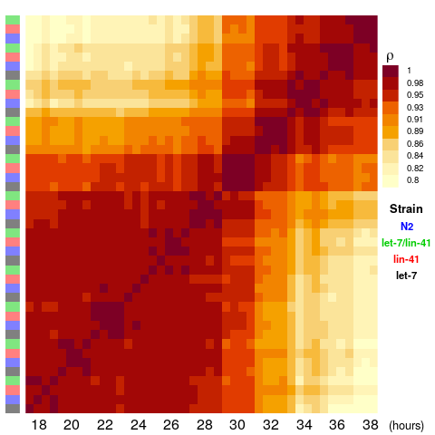
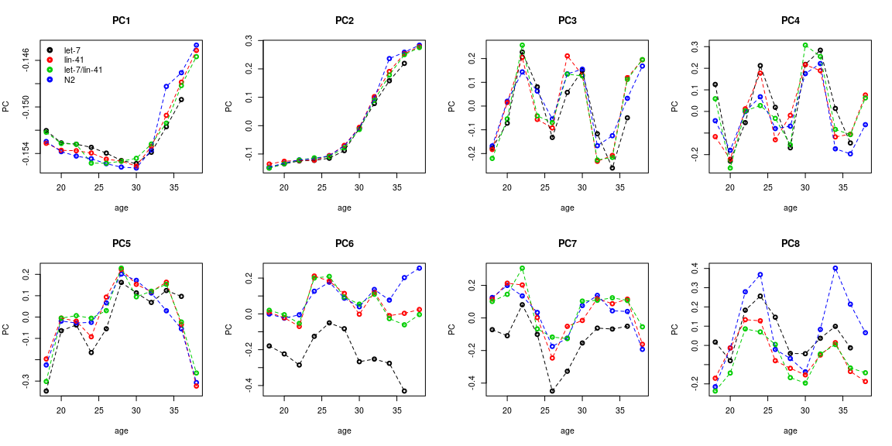
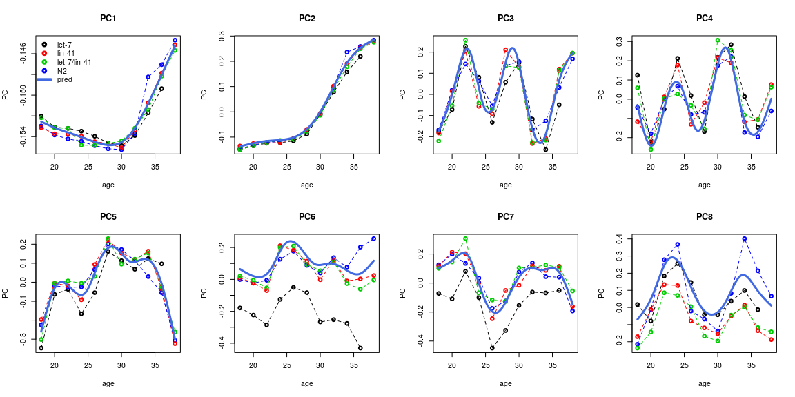

### The data

**The datasets in this example are those used for all the *in-text* examples throughout the reference-building vignette.**

We are using the two *C. elegans* time series datasets. 

 1. A time series of larval development in 4 different strains published by @aeschimann2017lin41, called `ds1`. This is the dataset used to build the reference. (Accession : [GSE80157](https://www.ncbi.nlm.nih.gov/geo/query/acc.cgi?acc=GSE80157))
 1. A high-resolution time series of late larval development published by @hendriks2014extensive, called `ds2`. This is the dataset used for external validation. (Accession : [GSE52861](https://www.ncbi.nlm.nih.gov/geo/query/acc.cgi?acc=GSE52861))

#### {.tabset}

<a name="code-gen_ds1-ds2"></a>

Code to generate `ds1` and `ds2` :

##### Hide

##### Show

```r
raw2rpkm <- function(X, gene.length, id.col = 1, l.col='length'){
  # Compute RPKM from raw counts
  if(!all(rownames(X)%in%gene.length[, id.col])){
    stop("Some genes are missing length info !")
  }
  res <- sapply(colnames(X), function(samp){
    pm <- sum(X[,samp])/1e6
    rpkm <- (X[,samp]/pm)/(gene.length[match(rownames(X), gene.length[, id.col]), l.col]/1000)
  })
  rownames(res) <- rownames(X)
  return(res)
}
```

<br>

###### `ds1`

```r
geo_ds1 <- "GSE80157"

g_url_ds1 <- GEOquery::getGEOSuppFiles(geo_ds1, makeDirectory = FALSE, fetch_files = FALSE)
g_file_ds1 <- "../inst/extdata/ds1.txt.gz"
utils::download.file(url = as.character(g_url_ds1$url[2]), destfile = g_file_ds1)

X_ds1 <- read.table(gzfile(g_file_ds1), h=T, sep = '\t', stringsAsFactors = F, row.names = 1)

# convert to rpkm & wb_id
X_ds1 <- format_ids(X_ds1, wormRef::Cel_genes, from = "wb_id", to = "wb_id")
X_ds1 <- raw2rpkm(X = X_ds1, gene.length = wormRef::Cel_genes, id.col = "wb_id", l.col = "transcript_length")


# pheno data
P_ds1 <- Biobase::pData(GEOquery::getGEO(geo_ds1, getGPL = F)[[1]])
P_ds1[,10:34] <- NULL
P_ds1[, 3:8] <- NULL

colnames(P_ds1)[4] <- "strain"
P_ds1$strain <- factor(P_ds1$strain)
P_ds1$title <- gsub('[-\\(\\);]', '.', P_ds1$title)

colnames(X_ds1) <- gsub('RNASeq_riboM_', '', colnames(X_ds1), fixed = T)
P_ds1$title <- gsub('RNASeq_riboM_', '', P_ds1$title, fixed = T)

# get age 
P_ds1$age <- as.numeric(sub('(\\d+)\\shours', '\\1', P_ds1$`time in development:ch1`))


X_ds1 <- X_ds1[, P_ds1$title]

ds1 <- list(g = X_ds1, p = P_ds1)
save(ds1, file = "../inst/extdata/ds1.RData", compress = "xz")

# cleanup
file.remove(g_file_ds1)
rm(geo_ds1, g_url_ds1, g_file_ds1, X_ds1, P_ds1)
```

<br>

###### `ds2`

```r
geo_ds2 <- "GSE52861"

g_url_ds2 <- GEOquery::getGEOSuppFiles(geo_ds2, makeDirectory = FALSE, fetch_files = FALSE)
g_file_ds2 <- "../inst/extdata/ds2.txt.gz"
utils::download.file(url = as.character(g_url_ds2$url[2]), destfile = g_file_ds2)

X_ds2 <- read.table(gzfile(g_file_ds2), h=T, sep = '\t', stringsAsFactors = F, row.names = 1)

# convert to rpkm & wb_id
X_ds2 <- format_ids(X_ds2, wormRef::Cel_genes, from = "wb_id", to = "wb_id")
X_ds2 <- raw2rpkm(X = X_ds2, gene.length = wormRef::Cel_genes, id.col = "wb_id", l.col = "transcript_length")


# pheno data
P_ds2 <- Biobase::pData(GEOquery::getGEO(geo_ds2, getGPL = F)[[1]])

# filter relevant fields/samples
P_ds2 <- P_ds2[(P_ds2$`strain:ch1` == 'N2') & (P_ds2$`growth protocol:ch1` == 'Continuous'), ]
P_ds2 <- P_ds2[, c("title", "geo_accession", "time in development:ch1")]

# get age 
P_ds2$age <- as.numeric(sub('(\\d+)\\shours', '\\1', P_ds2$`time in development:ch1`))


# formatting
P_ds2$title <- gsub('RNASeq_polyA_', '', 
                  gsub('hr', 'h', 
                       gsub('-', '.', fixed = T, as.character(P_ds2$title))))
colnames(X_ds2) <- gsub('RNASeq_polyA_','', colnames(X_ds2))
X_ds2 <- X_ds2[, P_ds2$title]

ds2 <- list(g = X_ds2, p = P_ds2)
save(ds2, file = "../inst/extdata/ds2.RData", compress = "xz")

# cleanup
file.remove(g_file_ds2)
rm(geo_ds2, g_url_ds2, g_file_ds2, X_ds2, P_ds2)
```


#### Normalization & Quick look


```r
ds1$g <- limma::normalizeBetweenArrays(ds1$g, method = "quantile")
ds1$g <- log(ds1$g + 1)

ds2$g <- limma::normalizeBetweenArrays(ds2$g, method = "quantile")
ds2$g <- log(ds2$g + 1)
```


```r
ds1$g[1:5, 1:5]
#>                let.7.n2853._18hr let.7.n2853._20hr let.7.n2853._22hr let.7.n2853._24hr
#> WBGene00000001          2.619273          2.530099          2.528902          2.518151
#> WBGene00000002          2.204660          2.527502          2.095510          1.922935
#> WBGene00000003          2.210836          2.005761          2.105462          2.291663
#> WBGene00000004          2.481065          2.335821          2.190166          2.217177
#> WBGene00000005          1.586324          2.152875          1.498992          1.135504
#>                let.7.n2853._26hr
#> WBGene00000001          2.497320
#> WBGene00000002          2.348547
#> WBGene00000003          1.810433
#> WBGene00000004          2.105118
#> WBGene00000005          1.697602

head(ds1$p, n = 5)
#>                        title geo_accession           organism_ch1       strain
#> GSM2113587 let.7.n2853._18hr    GSM2113587 Caenorhabditis elegans let-7(n2853)
#> GSM2113588 let.7.n2853._20hr    GSM2113588 Caenorhabditis elegans let-7(n2853)
#> GSM2113589 let.7.n2853._22hr    GSM2113589 Caenorhabditis elegans let-7(n2853)
#> GSM2113590 let.7.n2853._24hr    GSM2113590 Caenorhabditis elegans let-7(n2853)
#> GSM2113591 let.7.n2853._26hr    GSM2113591 Caenorhabditis elegans let-7(n2853)
#>            time in development:ch1 age
#> GSM2113587                18 hours  18
#> GSM2113588                20 hours  20
#> GSM2113589                22 hours  22
#> GSM2113590                24 hours  24
#> GSM2113591                26 hours  26
```

##### Correlation Matrix


##### Plotting components


```r
pca_ds1 <- stats::prcomp(ds1$g, rank = 25)
```




### Model fitting

#### Component number


```r
nc <- sum(summary(pca_ds1)$importance[3,] < .999) + 1
nc
#> [1] 24
```

#### Model


```r
m_ds1 <- ge_im(X = ds1$g, p = ds1$p, formula = "X ~ s(age, bs = 'cr') + strain", nc = nc)
```


```
#>       aCC         aRE         MSE      aRMSE
#>  0.817616 0.008558632 0.004256494 0.06524181
```


#### Validation

##### Predict


```r
# setup newdat
n.inter <- 100 # nb of new timepoints
newdat <- data.frame(
  age = seq(min(ds1$p$age), max(ds1$p$age), l = n.inter),
  strain = rep("N2", n.inter) # we want to predict as N2 
  )
head(newdat)
#>        age strain
#> 1 18.00000     N2
#> 2 18.20202     N2
#> 3 18.40404     N2
#> 4 18.60606     N2
#> 5 18.80808     N2
#> 6 19.01010     N2

# predict 
pred_m_ds1 <- predict(m_ds1, newdata = newdat)
pred_m_ds1_comp <- predict(m_ds1, newdata = newdat, as.c = TRUE)
```

##### Plot component predictions



##### Build reference & stage samples


```r
# make a 'reference object' 
r_ds1 <- list(interpGE = pred_m_ds1, time.series = newdat$age)

ae_ds1 <- ae(ds1$g, r_ds1$interpGE, r_ds1$time.series)
ae_ds2 <- ae(ds2$g, r_ds1$interpGE, r_ds1$time.series)
```


