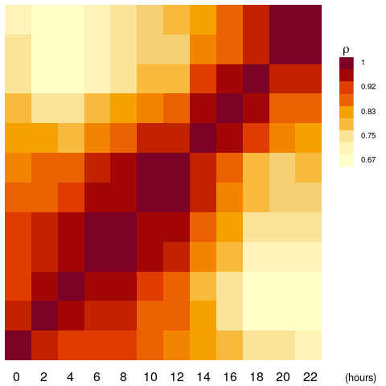
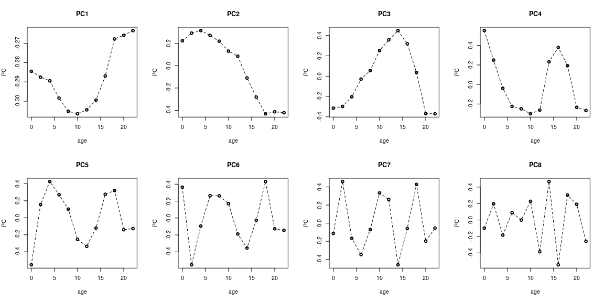
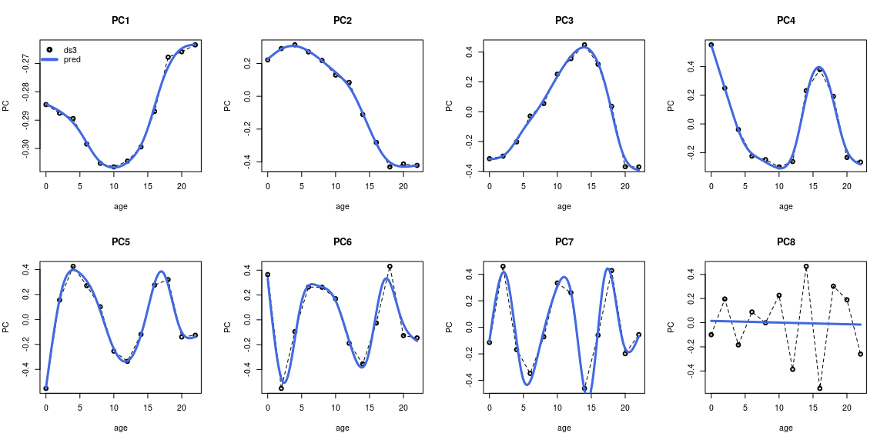
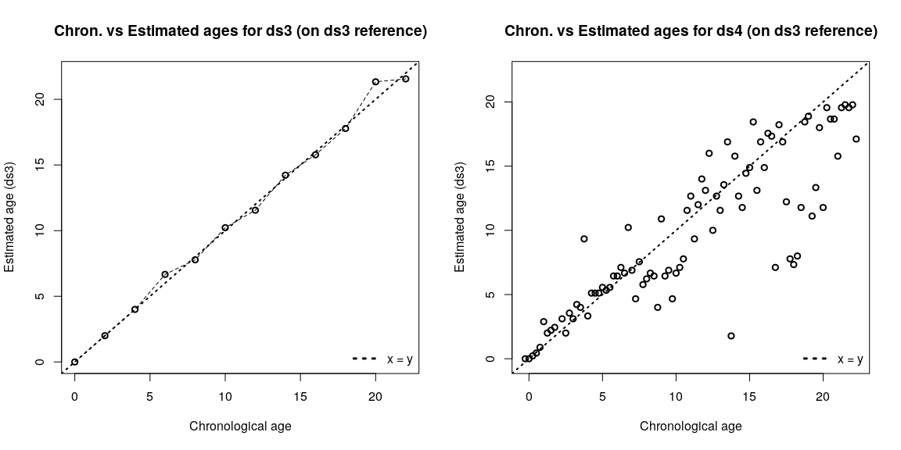
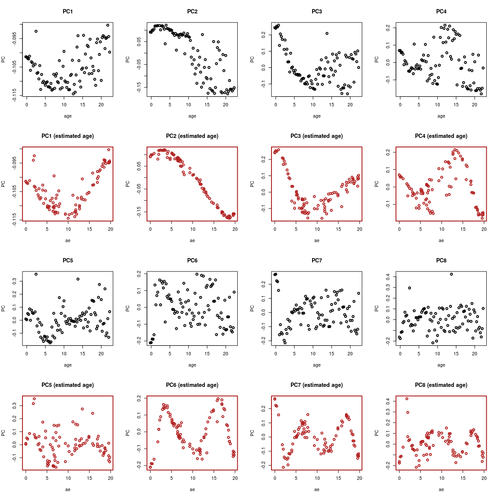

### The data

We are using two *Drosophila melanogaster*  embryonic development time series datasets. 
The dataset used to build the reference was chosen with a very low time resolution on purpose to display the effectiveness of interpolating on gene expression data

1. A time series Drosophila embryonic development, part of the modENCODE project and published by @graveley2011developmental, hereafter called `ds3`. This is the dataset used to build the reference. (Data downloaded from [fruitfly.org](https://fruitfly.org/sequence/download.html))
 1. A high-resolution time series of embryonic development published by @levin2016mid, called `ds4`. This is the dataset used for external validation. (Accession : [GSE60471](https://www.ncbi.nlm.nih.gov/geo/query/acc.cgi?acc=GSE60471))

#### {.tabset}
Code to generate `ds3` and `ds4` :

##### Hide

##### Show

```r
raw2rpkm <- function(X, gene.length, id.col = 1, l.col='length'){
  # Compute RPKM from raw counts
  if(!all(rownames(X)%in%gene.length[, id.col])){
    stop("Some genes are missing length info !")
  }
  res <- sapply(colnames(X), function(samp){
    pm <- sum(X[,samp])/1e6
    rpkm <- (X[,samp]/pm)/(gene.length[match(rownames(X), gene.length[, id.col]), l.col]/1000)
  })
  rownames(res) <- rownames(X)
  return(res)
}
```


```r
requireNamespace("biomaRt", quietly = TRUE)

mart <- biomaRt::useMart("ensembl", dataset = "dmelanogaster_gene_ensembl")
droso_genes <- biomaRt::getBM(attributes = c("ensembl_gene_id", 
                                             "ensembl_transcript_id",
                                             "external_gene_name",
                                             "transcript_length"),
                              mart = mart)
colnames(droso_genes)[1:3] <- c("fb_id", "transcript_id", "gene_name")

rm(mart)
```

<br>

###### `ds3`


```r
g_url_ds3 <- "ftp://ftp.fruitfly.org/pub/download/modencode_expression_scores/Celniker_Drosophila_Annotation_20120616_1428_allsamps_MEAN_gene_expression.csv.gz"
g_file_ds3 <- "../inst/extdata/ds3.csv.gz"
utils::download.file(g_url_ds3, destfile = g_file_ds3)


X_ds3 <- read.table(gzfile(g_file_ds3), sep = ',', row.names = 1, h = T)

# convert gene ids to FBgn
X_ds3 <- format_ids(X_ds3, droso_genes, from = "gene_name", to = "fb_id")

# select embryo time series samples
X_ds3 <- X_ds3[,1:12]

P_ds3 <- data.frame(sname = colnames(X_ds3),
                    age = as.numeric(gsub("em(\\d+)\\.\\d+hr", "\\1", colnames(X_ds3))),
                    stringsAsFactors = FALSE)

ds3 <- list(g = X_ds3, p = P_ds3)

save(ds3, file = "../inst/extdata/ds3.RData", compress = "xz")

# cleanup
file.remove(g_file_ds3)
rm(g_url_ds3, g_file_ds3, X_ds3, P_ds3)
```


<br>

###### `ds4`

```r
geo_ds4 <- "GSE60471"

g_url_ds4 <- GEOquery::getGEOSuppFiles(geo_ds4, makeDirectory = FALSE, fetch_files = FALSE)
g_file_ds4 <- "../inst/extdata/ds4.txt.gz"
utils::download.file(url = as.character(g_url_ds4$url[3]), destfile = g_file_ds4)

X_ds4 <- read.table(gzfile(g_file_ds4), h = T, sep = '\t', as.is = T, row.names = 1, comment.char = "")

# filter poor quality samples
cm_ds4 <- RAPToR::cor.gene_expr(X_ds4, X_ds4)
f_ds4 <- which(0.6 > apply(cm_ds4, 1, quantile, probs = .99))
X_ds4 <- X_ds4[, -f_ds4]

# convert to rpkm & FBgn
X_ds4 <- format_ids(X_ds4, droso_genes, from = "fb_id", to = "fb_id")
X_ds4 <- raw2rpkm(X = X_ds4, gene.length = droso_genes, id.col = "fb_id", l.col = "transcript_length")


# pheno data
P_ds4 <- Biobase::pData(GEOquery::getGEO(geo_ds4, getGPL = F)[[1]])

# filter relevant fields/samples
P_ds4 <- P_ds4[, c("title", "geo_accession", "time (minutes cellularization stage):ch1")]
colnames(P_ds4)[3] <- "time"
P_ds4$title <- as.character(P_ds4$title)

P_ds4 <- P_ds4[P_ds4$title %in% colnames(X_ds4),]
X_ds4 <- X_ds4[, P_ds4$title]

# formatting
P_ds4$title <- gsub('Metazome_Drosophila_timecourse_', '', P_ds4$title)
colnames(X_ds4) <- P_ds4$title

P_ds4$age <- as.numeric(P_ds4$time) / 60

ds4 <- list(g = X_ds4, p = P_ds4)
save(ds4, file = "../inst/extdata/ds4.RData", compress = "xz")

# cleanup
file.remove(g_file_ds4)
rm(geo_ds4, g_url_ds4, g_file_ds4, X_ds4, P_ds4)
```


```r
rm(droso_genes, raw2rpkm)
```


#### Normalization & Quick look


```r
ds3$g <- limma::normalizeBetweenArrays(ds3$g, method = "quantile")
ds3$g <- log(ds3$g + 1)

ds4$g <- limma::normalizeBetweenArrays(ds4$g, method = "quantile")
ds4$g <- log(ds4$g + 1)
```


```r
ds3$g[1:5, 1:5]
#>               em0.2hr   em2.4hr   em4.6hr   em6.8hr  em8.10hr
#> FBgn0000003 3.9651391 4.2738527 3.3174101 4.5644242 4.6982706
#> FBgn0000008 1.2949845 0.9215699 0.6958672 0.6476801 0.7445991
#> FBgn0000014 0.5099295 0.9512866 1.3952815 1.8610406 1.8421960
#> FBgn0000015 0.2435639 0.6423988 1.0511912 1.1094674 1.0194280
#> FBgn0000017 1.7968429 2.0901351 1.3389420 1.5336183 1.6777064

head(ds3$p, n = 5)
#>      sname age
#> 1  em0.2hr   0
#> 2  em2.4hr   2
#> 3  em4.6hr   4
#> 4  em6.8hr   6
#> 5 em8.10hr   8
```

##### Correlation Matrix


##### Plotting components


```r
pca_ds3 <- stats::prcomp(ds3$g, rank = 12)
```




### Model fitting

#### Component number


```r
nc <- sum(summary(pca_ds3)$importance[3,] < .999) + 1
nc
#> [1] 10
```

#### Model


```r
m_ds3 <- ge_im(X = ds3$g, p = ds3$p, formula = "X ~ s(age, bs = 'cr')", nc = nc)
```


```
#>        aCC         aRE         MSE      aRMSE
#>  0.9094025 -0.04019692 0.005621654 0.07497769
```


#### Validation

##### Predict


```r
# setup newdat
n.inter <- 100 # nb of new timepoints
newdat <- data.frame(
  age = seq(min(ds3$p$age), max(ds3$p$age), l = n.inter)
  )
head(newdat)
#>         age
#> 1 0.0000000
#> 2 0.2222222
#> 3 0.4444444
#> 4 0.6666667
#> 5 0.8888889
#> 6 1.1111111

# predict 
pred_m_ds3 <- predict(m_ds3, newdata = newdat)
pred_m_ds3_comp <- predict(m_ds3, newdata = newdat, as.c = TRUE)
```

##### Plot component predictions



##### Build reference & stage samples


```r
# make a 'reference object' 
r_ds3 <- list(interpGE = pred_m_ds3, time.series = newdat$age)

ae_ds3 <- ae(ds3$g, r_ds3$interpGE, r_ds3$time.series)
ae_ds4 <- ae(ds4$g, r_ds3$interpGE, r_ds3$time.series)
```





Notice here, that our validation dataset's estimates appear quite noisy.
However, if we look at the dynamics of the `ds4` data, we'll see that the chronological age specified for the samples is erroneous.


```r
pca_ds4 <- stats::prcomp(ds4$g, rank = 20)
```



This demonstrates the difficulty of producing high-resolution time series due to developmental asynchronicity between the samples.
