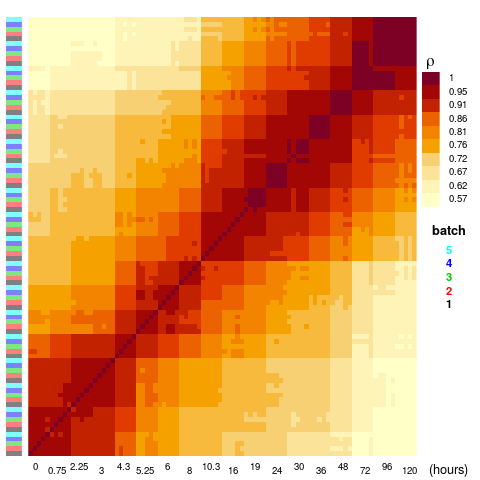
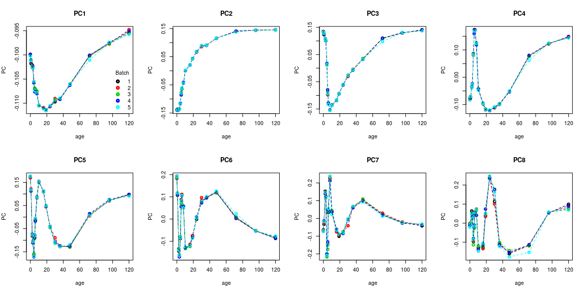
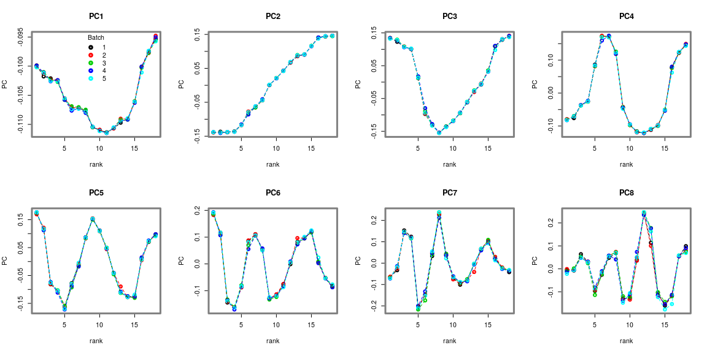
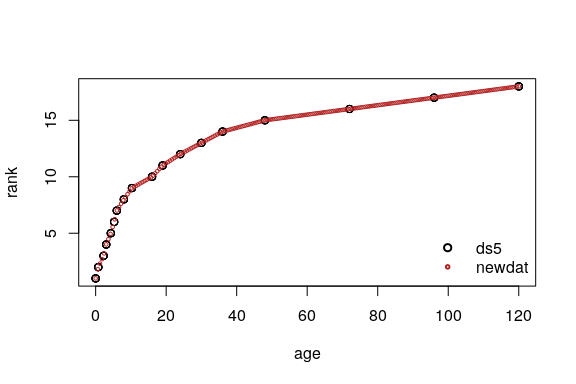
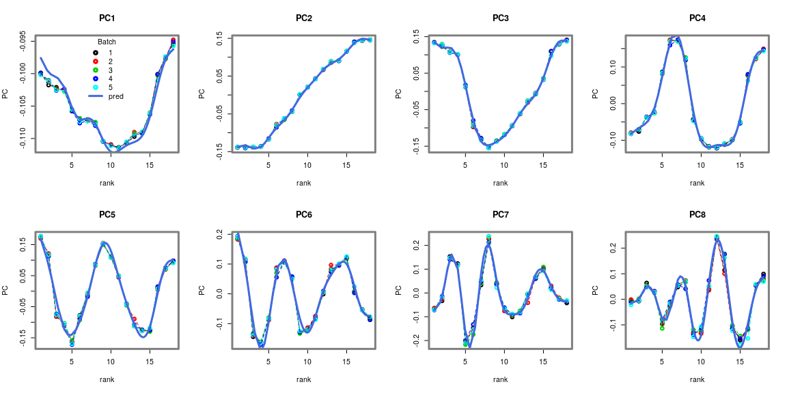
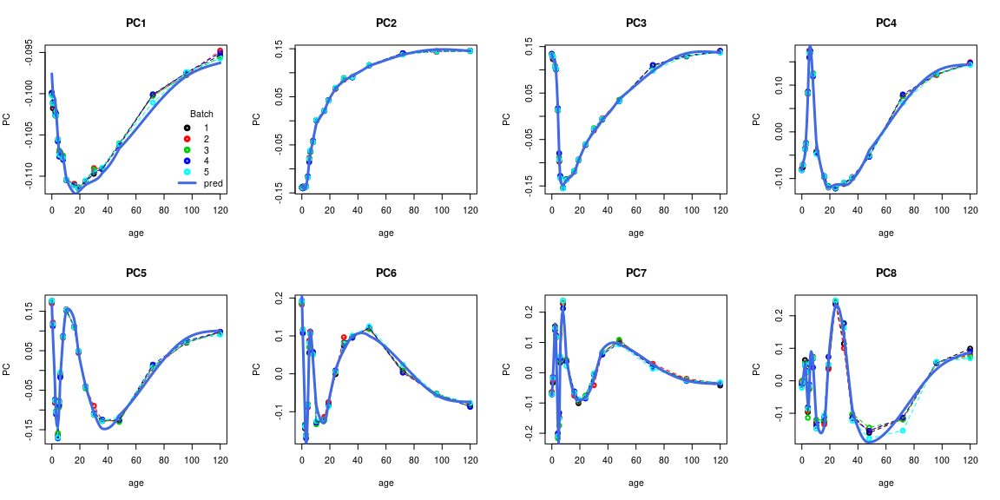
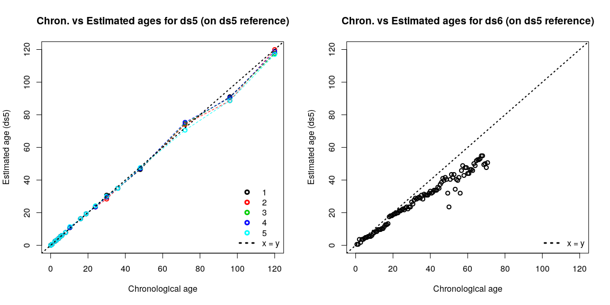
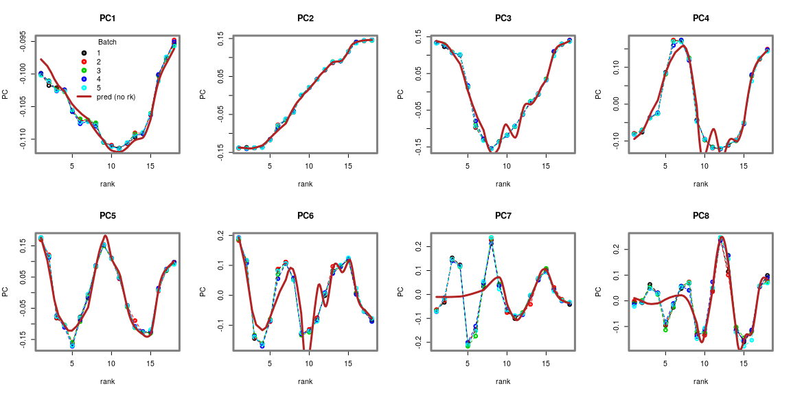
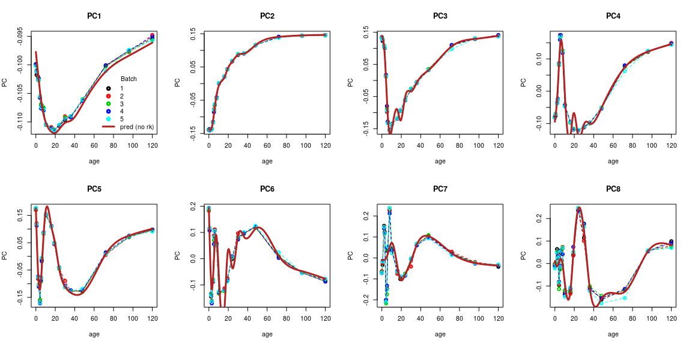
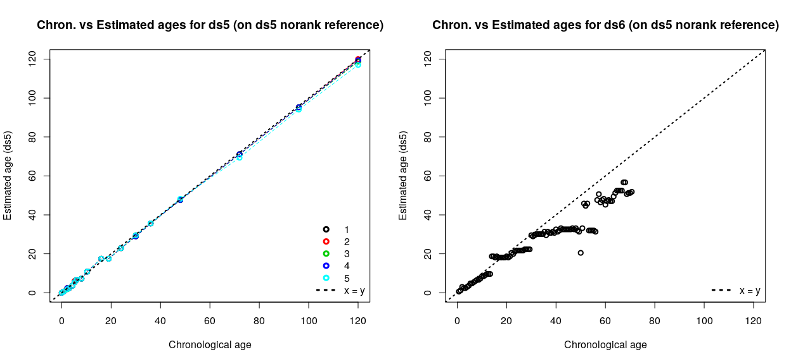

### The data

We are using two *Danio rerio* (zebrafish) embryonic development time series datasets. 
The dataset used to build the reference has uneven time sampling, as can often be the case.

We show a trick using ranks to build an adequate model in order to avoid interpolation bias. 

The datasets are 

 1. A time series of zebrafish embryonic development (with uneven sampling) published by @white2017high, hereafter called `ds5`. This is the dataset used to build the reference. ([Data accessible in the publication](https://elifesciences.org/articles/30860))
 1. A high-resolution time series of embryonic development published by @levin2016mid, hereafter called `ds6`. This is the dataset used for external validation. (Accession : [GSE60619](https://www.ncbi.nlm.nih.gov/geo/query/acc.cgi?acc=GSE60619))

#### {.tabset}
Code to generate `ds5` and `ds6` :

##### Hide

##### Show

```r
raw2rpkm <- function(X, gene.length, id.col = 1, l.col='length'){
  # Compute RPKM from raw counts
  if(!all(rownames(X)%in%gene.length[, id.col])){
    stop("Some genes are missing length info !")
  }
  res <- sapply(colnames(X), function(samp){
    pm <- sum(X[,samp])/1e6
    rpkm <- (X[,samp]/pm)/(gene.length[match(rownames(X), gene.length[, id.col]), l.col]/1000)
  })
  rownames(res) <- rownames(X)
  return(res)
}
```


```r
requireNamespace("biomaRt", quietly = TRUE)

mart <- biomaRt::useMart("ensembl", dataset = "drerio_gene_ensembl")
zeb_genes <- biomaRt::getBM(attributes = c("ensembl_gene_id", "transcript_length"), 
                               mart = mart)
rm(mart)
```

<br>

###### `ds5`

```r
p_url_ds5 <- "http://europepmc.org/articles/PMC5690287/bin/elife-30860-supp1.tsv"

g_url_ds5 <- "http://europepmc.org/articles/PMC5690287/bin/elife-30860-supp2.tsv"
g_file_ds5 <- "../inst/extdata/ds5.tsv"
utils::download.file(g_url_ds5, destfile = g_file_ds5)

X_ds5 <- read.table(g_file_ds5, h = T, sep  ="\t", as.is = T, quote = "\"")
rownames(X_ds5) <- X_ds5$Gene.ID
X_ds5 <- X_ds5[,-(1:8)]


# convert to rpkm & ensembl_id
X_ds5 <- format_ids(X_ds5, zeb_genes, from = "ensembl_gene_id", to = "ensembl_gene_id")
X_ds5 <- raw2rpkm(X = X_ds5, gene.length = zeb_genes, id.col = "ensembl_gene_id", l.col = "transcript_length")


# pheno data
P_ds5 <- read.table(p_url_ds5, h = T, sep = "\t", as.is = T)
P_ds5 <- P_ds5[P_ds5$sequencing == "RNASeq", c("sample", "accession_number", "stage", "stageName", "sampleName")]

# timings of stages from the White et al. eLife (2017) publication of the data.
# time given in hours post-fertilization
timepoints <- data.frame(stage = unique(P_ds5$stageName), 
                         hours_pf = c(0, .75, 2.25, 3, 4.3, 5.25, 6, 8, 10.3, 
                                      16, 19, 24, 30, 36, 48, 72, 96, 120),
                         stringsAsFactors = F, row.names = "stage")
P_ds5$age <- timepoints[P_ds5$stageName, "hours_pf"]
P_ds5$batch <- factor(gsub(".*-(\\d)$", "\\1", P_ds5$sampleName))

X_ds5 <- X_ds5[, P_ds5$sample]

ds5 <- list(g = X_ds5, p = P_ds5)
save(ds5, file = "../inst/extdata/ds5.RData", compress = "xz")

# cleanup
file.remove(g_file_ds5)
rm(p_url_ds5, g_url_ds5, g_file_ds5, X_ds5, P_ds5, timepoints)
```

<br>

###### `ds6`

```r
geo_ds6 <- "GSE60619"

g_url_ds6 <- GEOquery::getGEOSuppFiles(geo_ds6, makeDirectory = FALSE, fetch_files = FALSE)
g_file_ds6 <- "../inst/extdata/ds6.txt.gz"
utils::download.file(url = as.character(g_url_ds6$url[2]), destfile = g_file_ds6)

X_ds6 <- read.table(gzfile(g_file_ds6), h = T, sep = '\t', as.is = T, row.names = 1, comment.char = "")

# convert to rpkm & ensembl id
X_ds6 <- format_ids(X_ds6, zeb_genes, from = "ensembl_gene_id", to = "ensembl_gene_id")
X_ds6 <- raw2rpkm(X = X_ds6, gene.length = zeb_genes, id.col = "ensembl_gene_id", l.col = "transcript_length")


# pheno data
P_ds6 <- Biobase::pData(GEOquery::getGEO(geo_ds6, getGPL = F)[[1]])

# filter relevant fields/samples
P_ds6 <- P_ds6[, c("title", "geo_accession", "time (min after fertilization):ch1")]
colnames(P_ds6)[3] <- "time"
P_ds6$title <- as.character(P_ds6$title)

P_ds6 <- P_ds6[P_ds6$title %in% colnames(X_ds6),]
X_ds6 <- X_ds6[, P_ds6$title]

# formatting
P_ds6$title <- gsub('Metazome_ZF_timecourse_', '', P_ds6$title)
colnames(X_ds6) <- P_ds6$title

P_ds6$age <- as.numeric(P_ds6$time) / 60

ds6 <- list(g = X_ds6, p = P_ds6)
save(ds6, file = "../inst/extdata/ds6.RData", compress = "xz")

# cleanup
file.remove(g_file_ds6)
rm(geo_ds6, g_url_ds6, g_file_ds6, X_ds6, P_ds6)
```


```r
rm(zeb_genes, raw2rpkm)
```


#### Normalization & Quick look


```r
ds5$g <- limma::normalizeBetweenArrays(ds5$g, method = "quantile")
ds5$g <- log(ds5$g + 1)

ds6$g <- limma::normalizeBetweenArrays(ds6$g, method = "quantile")
ds6$g <- log(ds6$g + 1)
```


```r
ds5$g[1:5, 1:5]
#>                    zmp_ph133_B zmp_ph133_D zmp_ph133_E zmp_ph133_F zmp_ph133_G
#> ENSDARG00000000001    1.992991    1.827910   1.7427071    1.839980   1.7305791
#> ENSDARG00000000002    1.013519    1.049910   0.7850242    1.046494   0.8564017
#> ENSDARG00000000018    2.247738    2.322763   2.0246236    2.159045   2.3384767
#> ENSDARG00000000019    4.198081    4.295515   4.3738184    4.298936   4.3578940
#> ENSDARG00000000068    4.172288    4.226427   4.0332980    4.059632   3.9252796

head(ds5$p, n = 5)
#>        sample accession_number         stage stageName sampleName age batch
#> 1 zmp_ph133_B       ERS1079239 Zygote:1-cell    1-cell   1-cell-1   0     1
#> 2 zmp_ph133_D       ERS1079240 Zygote:1-cell    1-cell   1-cell-2   0     2
#> 3 zmp_ph133_E       ERS1079241 Zygote:1-cell    1-cell   1-cell-3   0     3
#> 4 zmp_ph133_F       ERS1079243 Zygote:1-cell    1-cell   1-cell-4   0     4
#> 5 zmp_ph133_G       ERS1079244 Zygote:1-cell    1-cell   1-cell-5   0     5
```

##### Correlation Matrix


##### Plotting components


```r
pca_ds5 <- stats::prcomp(ds5$g, rank = 25)
```



Notice how the sampling is sparser towards the end of the time series, with dynamics being "wider".
Fitting splines on the components here will lead to a poor fit of the earlier timepoints.

To bypass this issue, we can use ranks instead of the timepoints.


```r
# using data.table's rank function to get the "dense" tie method
ds5$p$rank <- data.table::frank(ds5$p$age, ties.method = "dense")
```




These dynamics will be fitted much more cleanly.
To predict the data in a uniform time scale, we can just pick values on the rank scale such that they translate to a uniform series on the age scale with a simple linear warp, as will be done below.


### Model fitting

#### Component number


```r
nc <- sum(summary(pca_ds5)$importance[3,] < .999) + 1
nc
#> [1] 77
```

#### Model


```r
m_ds5 <- ge_im(X = ds5$g, p = ds5$p, formula = "X ~ s(rank, bs = 'ds') + batch", nc = nc)
```


```
#>        aCC       aRE        MSE     aRMSE
#>  0.8772099 0.2281205 0.01266176 0.1125245
```


#### Validation

##### Predict

We'll be using a linear warp to get a uniform time series.


```r
linwarp <- function(x, xyt, xc = 1, yc = 2){
  # Computes a linear interpolation of input x to y value
  # x = values of x to convert to y
  # xyt = table with known sets of x/y
  # xc, yc = column indices of x and y in xyt
  
  if(min(x) < min(xyt[,xc]) | max(x) > max(xyt[,xc]))
    stop("Some values of x are outside of the known x/y sets")
  
  # set up y to x conversion table
  xyt <- xyt[!duplicated.default(xyt[,xc]),]
  xyt <- xyt[order(xyt[,xc]),]
  
  xyt[,"dify"] <- c(0, diff(xyt[,yc]))
  xyt[,"difx"] <- c(1, diff(xyt[,xc]))
  xyt <- rbind(xyt[1,], xyt) # double 1st line for edge case

  xout <- unlist(sapply(x, function(xi){
    rsup <- which(xyt[-1,xc] >= xi)[1] + 1
    xyt[rsup-1, yc] + (xi - xyt[rsup-1, xc])/xyt[rsup, "difx"] * xyt[rsup, "dify"]
  }))
  
  return(xout)
}
```


```r
# setup newdat
n.inter <- 200
newdat <- data.frame(age = seq(min(ds5$p[, "age"]), max(ds5$p[, "age"]), l = n.inter),
                     batch = rep("1", n.inter)) # predict as batch 1

# apply linwarp
newdat$rank <- linwarp(newdat$age, xyt = ds5$p[, c("age", "rank")], xc = 1, yc = 2)

head(newdat)
#>         age batch     rank
#> 1 0.0000000     1 1.000000
#> 2 0.6030151     1 1.804020
#> 3 1.2060302     1 2.304020
#> 4 1.8090452     1 2.706030
#> 5 2.4120603     1 3.216080
#> 6 3.0150754     1 4.011596

# predict 
pred_m_ds5 <- predict(m_ds5, newdata = newdat)
pred_m_ds5_comp <- predict(m_ds5, newdata = newdat, as.c = TRUE)
```

We want a uniform series on the age scale, but have to input values on the rank scale in the model which is why we use `linwarp()`.
To give a sense of what the function did, we can plot the ranks against the age. 




##### Plot component predictions

On the rank scale : 



Back on the age scale :




##### Build reference & stage samples


```r
# make a 'reference object' 
r_ds5 <- list(interpGE = pred_m_ds5, time.series = newdat$age)

ae_ds5 <- ae(ds5$g, r_ds5$interpGE, r_ds5$time.series)
ae_ds6 <- ae(ds6$g, r_ds5$interpGE, r_ds5$time.series)
```





##### On a model without using ranks

We'll build the same model (not the optimal model !) without considering uneven sampling, for comparison.


```r
m_ds5_norank <- ge_im(X = ds5$g, p = ds5$p, formula = "X ~ s(age, bs = 'ds') + batch", nc = nc)
```


```
#>        aCC       aRE        MSE     aRMSE
#>  0.8477562 0.2153231 0.01803523 0.1342953
```


```r
pred_m_ds5_norank <- predict(m_ds5_norank, newdata = newdat)
pred_m_ds5_comp_norank <- predict(m_ds5_norank, newdata = newdat, as.c = TRUE)
```

Let's plot the components on the rank and age scales, as before.



Back on the age scale :



We can already see that the model has trouble predicting the dynamics accurately.
For example, we pick up noise in PC6 and flatten dynamics in PC7.

This has consequences on the estimates *of the validation dataset*, as you'll see when we stage the samples.


```r
# make a 'reference object' 
r_ds5_norank <- list(interpGE = pred_m_ds5_norank, time.series = newdat$age)

ae_ds5_norank <- ae(ds5$g, r_ds5_norank$interpGE, r_ds5_norank$time.series)
ae_ds6_norank <- ae(ds6$g, r_ds5_norank$interpGE, r_ds5_norank$time.series)
```




The "gaps" or "steps" you can see on the validation dataset's estimates are due to interpolation bias : the picked up noise and flattened dynamics mentioned above.
Essentially, the model errors create local "unlikely/unrealistic" gene expression zones, which will not correlate well with the samples of corresponding age.
These zones will most often find themselves in the gaps between timepoints of the dataset used to build the reference, meaning the estimates of its samples are unaffected.

While we've used a suboptimal model here (which clearly displays the model errors on component plots), some interpolation bias can be much more subtle. 
In such cases, this is something that can only be assessed using an external dataset. 
